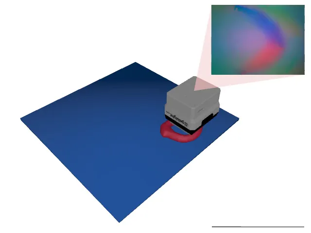
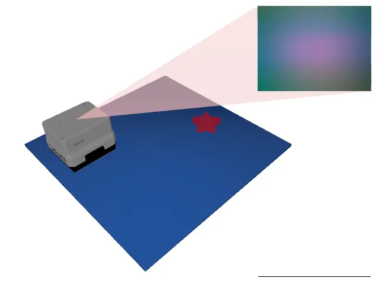
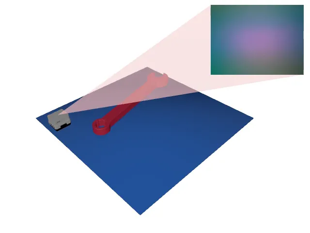
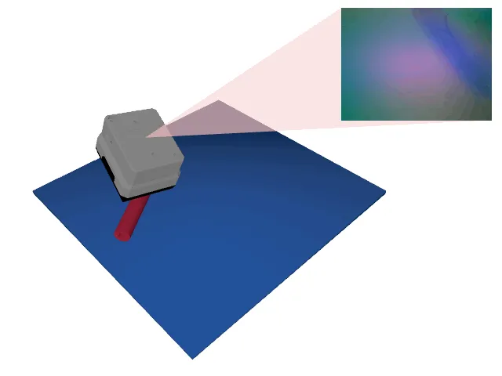
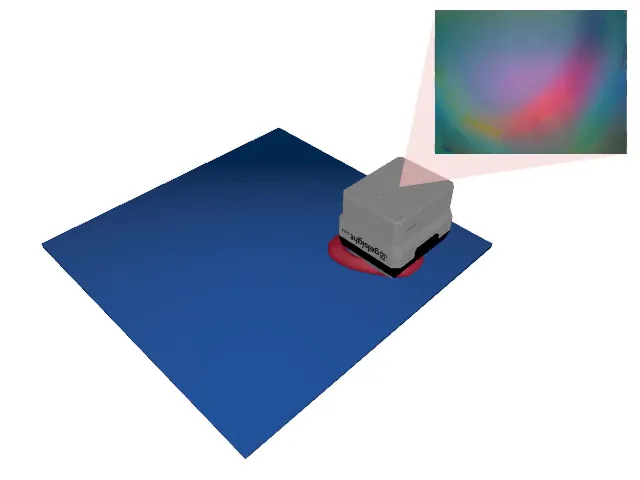
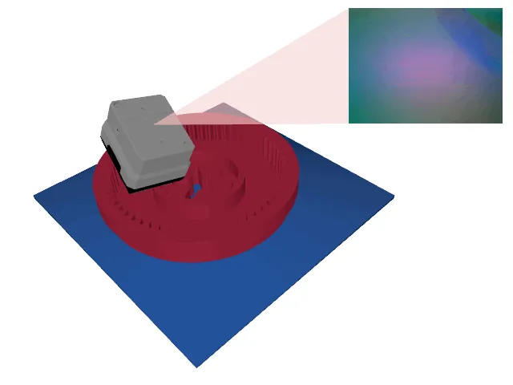
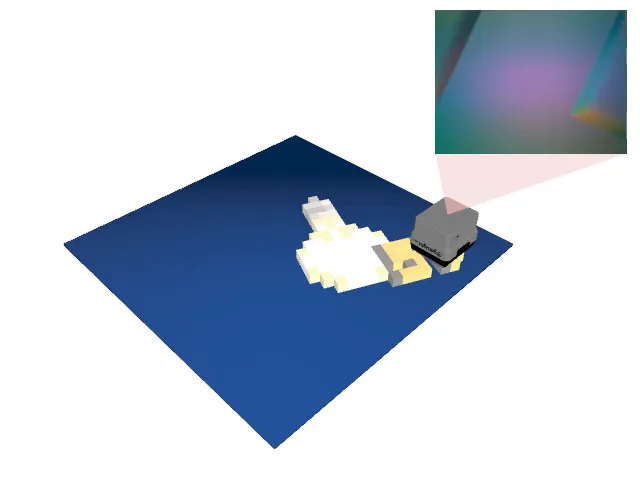

# The Tactile MNIST Active Perception Benchmark Suite

<table style="border-collapse: collapse; border: none;">
    <tr style="border: none;">
        <td align="center" style="border: none; padding: 10px;">
            <br/>
            <a href="docs/TactileMNIST.md">
                TactileMNIST-v0
            </a>
        </td>
        <td align="center" style="border: none; padding: 10px;">
            <br/>
            <a href="docs/Starstruck.md">
                Starstruck-v0
            </a>
        </td>
        <td align="center" style="border: none; padding: 10px;">
            <br/>
            <a href="docs/Toolbox.md">
                Toolbox-v0
            </a>
        </td>
    </tr>
</table>
<table style="border-collapse: collapse; border: none;">
    <tr style="border: none;">
        <td align="center" style="border: none; padding: 10px;">
            <br/>
            <a href="docs/ABCCenterOfMass.md">
                ABCCenterOfMass-v0
            </a>
        </td>
        <td align="center" style="border: none; padding: 10px;">
            <br/>
            <a href="docs/TactileMNISTVolume.md">
                TactileMNISTVolume-v0
            </a>
        </td>
        <td align="center" style="border: none; padding: 10px;">
            <br/>
            <a href="docs/ABCVolume.md">
                ABCVolume-v0
            </a>
        </td>
    </tr>
</table>
<table style="border-collapse: collapse; border: none;">
    <tr style="border: none;">
        <td align="center" style="border: none; padding: 10px;">
            <br/>
            <a href="docs/Minecraft.md">
                Minecraft-v0
            </a>
        </td>
        <td align="center" style="border: none; padding: 10px;">
            <br/>
            <a href="docs/MinecraftPose.md">
                MinecraftPose-v0
            </a>
        </td>
    </tr>
</table>

Tactile MNIST is a benchmark for learning-based active perception algorithms.
It introduces twelve simulated tactile perception tasks, ranging from classification and counting to pose, volume, and shape estimation.
Each task comes with a unique set of challenges and, thus, Tactile MNIST requires adaptive algorithms and clever exploration strategies.
The aim of Tactile MNIST is to provide an extensible framework for a fair comparison of active tactile perception methods.

Tactile MNIST implements each task as an [ap_gym](https://github.com/TimSchneider42/active-perception-gym) environment and is, thus, very straightforward to set up and use.
In each task, the agent controls a single simulated [GelSight Mini](https://www.gelsight.com/gelsightmini/) above a platform with some task-specific objects.
The agent's objective is to make a prediction about some property of the objects it is exploring, such as their class, count, pose, or volume.

In addition to the simulated benchmark tasks, this package provides access to a large dataset of real tactile images collected from 3D printed MNIST digits and a couple of synthetic datasets.

Further details can be found on our [project page](https://timschneider42.github.io/tactile-mnist/), which also links to the paper.

## Installation

Install Tactile MNIST via `pip`:

```bash
pip install tactile-mnist[OPTIONS]
```

where OPTIONS can be any number of the following (comma separated):

- `examples`: installs dependencies for the examples.
- `jax` (recommended) , `torch`, and `jax-cpu`: installs dependencies for the interactive Tactile MNIST environment with PyTorch, JAX, or JAX without CUDA support, respectively. Without any of those options, the interactive environment cannot be used but the static datasets will still work.

If you encounter problems during the installation or execution, check our [troubleshooting](#troubleshooting) section.

## Contents

This package provides [ap_gym](https://github.com/TimSchneider42/active-perception-gym) environments for twelve simulated [active tactile perception benchmark tasks](#simulated-active-tactile-perception-benchmark) and access to the [Tactile MNIST datasets](#datasets).
The ap_gym environments can be used to train and evaluate agents on active tactile perception problems on simulated data and are further described in the [Benchmark section](#simulated-active-tactile-perception-benchmark).
In the Tactile MNIST datasets, you find datasets of 3D CAD models (_MNIST 3D_, the procedurally generated _Starstruck_, and _ABC_) and several datasets of simulated and real tactile images.
This package provides an easy way of loading and working with these datasets, as further described in the [Datasets section](#datasets).

## Simulated Active Tactile Perception Benchmark

This package provides [ap_gym](https://github.com/TimSchneider42/active-perception-gym) environments for eleven active tactile perception environments: [TactileMNIST](docs/TactileMNIST.md), [Starstruck](docs/Starstruck.md), [Minecraft](docs/Minecraft.md), [Toolbox](docs/Toolbox.md), [MinecraftPose](docs/MinecraftPose.md), [TactileMNISTCenterOfMass](docs/TactileMNISTCenterOfMass.md), [ABCCenterOfMass](docs/ABCCenterOfMass.md), [TactileMNISTVolume](docs/TactileMNISTVolume.md), [ABCVolume](docs/ABCVolume.md), [TactileMNISTShape](docs/TactileMNISTShape.md), and [ABCShape](docs/ABCShape.md).
In all environments, the agent must solve a perception problem by actively controlling a [GelSight Mini](https://www.gelsight.com/gelsightmini/) tactile sensor in a simulated environment.

The _TactileMNIST_ environment challenges the agent to find and classify a [3D MNIST](docs/datasets.md#mnist-3d) model as quickly as possible.
aside from finding the object, the main challenge in the TactileMNIST environment is to learn contour following strategies to efficiently classify it once found.

In the _Starstruck_ environment, the agent must count the number of stars in a scene cluttered with other objects.
Since all stars look the same, distinguishing stars from other objects is rather straightforward.
Instead, the main challenge posed in this environment is to learn an effective search strategy to systematically cover as much space as possible.
The scenes are generated procedurally on the fly from a stable pseudo random number generator, so the agent cannot memorize the object arrangements.

The _Minecraft_ environment poses a classification problem over 301 classes of Minecraft items, whose meshes are generated by extruding the items' sprites the same way Minecraft renders dropped items.
With over 30 times more classes than TactileMNIST, the agent has to discriminate between a large number of partially very similar silhouettes, which requires precise contour following and efficient exploration.

The _Toolbox_ environment challenges the agent to locate a wrench positioned randomly on a platform and estimate its precise 2D position and 1D orientation.
Unlike the previous classification tasks, Toolbox poses a regression problem that requires combining multiple touch observations to resolve ambiguities inherent in the wrench’s shape.
For example, touching the handle may reveal lateral placement but not longitudinal position or orientation, making it critical for the agent to explore strategically and seek out one of the wrench’s ends to accurately determine its pose.
Overall, the Toolbox tests the agent’s ability to both find and precisely localize an object through sequential tactile exploration.

The _MinecraftPose_ environment poses the same pose estimation problem as Toolbox, except that the object is sampled from 301 different Minecraft items in each episode instead of always being the same wrench.
Hence, the agent has to learn exploration strategies that generalize across a large variety of object shapes.

In the _TactileMNISTCenterOfMass_ and _ABCCenterOfMass_ environments, the agent must determine the exact 2D position of the center of mass of an object from the [3D MNIST](docs/datasets.md#mnist-3d) and [ABC](docs/datasets.md#abc-dataset) datasets, respectively.
Unlike in the Toolbox environment, where the object shape is known, in TactileMNISTCenterOfMass and ABCCenterOfMass, the agent has to deal with a large variety of object shapes and learn thorough exploration policies.
Due to the larger variety of object shapes in the ABC dataset, we give the agent control over the sensor's rotation in ABCCenterOfMass, which adds another layer of complexity to the problem.

The _TactileMNISTVolume_ environment poses another regression problem.
Here, the agent must determine the exact volume of the [3D MNIST](docs/datasets.md#mnist-3d) model it is given.
Thus, unlike in the TactileMNIST environment, where a couple of touches might already be sufficient for classification, in TactileMNISTVolume, the agent has to make sure to explore the entire object.

Similar to the TactileMNISTVolume environment, the _ABCVolume_ environment challenges the agent to determine the exact volume of an object.
However, instead of 3D MNIST models, the objects in ABCVolume are randomly sampled from the [ABC dataset](docs/datasets.md#abc-dataset), which contains a large variety of 3D CAD models.
Similar to ABCCenterOfMass, we give the agent control over the sensor's rotation in ABCVolume.

Finally, the _TactileMNISTShape_ and _ABCShape_ environments challenge the agent to reconstruct the full 3D shape of an object from the [3D MNIST](docs/datasets.md#mnist-3d) and [ABC](docs/datasets.md#abc-dataset) datasets, respectively.
The shape is encoded as a compact latent embedding of a COD-VAE shape autoencoder, which the agent has to regress to and from which the object can be reconstructed.
Since every touch reveals only a small patch of the object's surface, the agent has to integrate information from many touches to build up a complete picture of the object's geometry.

A detailed description of the environments can be found [here](docs/TactilePerceptionEnv.md).

## Datasets

Aside of the simulated benchmark tasks, this package provides access to two classes of datasets: 3D mesh datasets and touch datasets.
Below is an overview of the datasets provided in this package:

- **[3D Mesh Datasets](docs/datasets.md#3d-mesh-datasets)**:
    1. **MNIST 3D**: a dataset of 3D models generated from a [high-resolution version of the MNIST dataset](https://arxiv.org/abs/2011.07946).
    2. **Starstruck**: a procedurally generated dataset in which the number of stars in a scene has to be counted (3 classes, 1 - 3 stars per scene).
    3. **ABC Dataset**: a variant of the [ABC dataset](https://deep-geometry.github.io/abc-dataset/), processed for the use with this benchmark suite.
- **[Touch Datasets](docs/datasets.md#touch-datasets)**
    1. **Synthetic Tactile MNIST**: a dataset of synthetic tactile images generated from the _MNIST 3D_ dataset with the [Taxim simulator](https://arxiv.org/abs/2109.04027).
    2. **Real Tactile MNIST**: a dataset of real tactile images of 3D printed _MNIST 3D_ digits collected with a Franka robot.
    3. **Synthetic Tactile Starstruck**: a dataset of synthetic tactile images generated from a [static version](https://huggingface.co/datasets/TimSchneider42/tactile-mnist-starstruck) of the _Starstruck_ dataset with the Taxim simulator.

A detailed description of the datasets can be found in the [Dataset documentation](docs/datasets.md).

## Troubleshooting

### Torch-Scatter Undefined Symbol Error
If you are seeing errors as such

```
OSError: [...]/torch_scatter/_version_cpu.so: undefined symbol: _ZN3c1017RegisterOperatorsD1Ev
```

then there are CUDA version incompatibilities between `torch_scatter`, PyTorch, and `nvcc`.

If you are seeing errors as such

```
RuntimeError: Not compiled with CUDA support
```

then `nvcc` was not found when installing `torch_scatter`.

In both cases, follow the instructions in the [official torch_scatter repository](https://github.com/rusty1s/pytorch_scatter) to install compatible PyTorch and `torch_scatter` versions.


## License

The project is licensed under the MIT license.

## Contributing

If you wish to contribute to this project, you are welcome to create a pull request.
Please run the [pre-commit](https://pre-commit.com/) hooks before submitting your pull request.
To install the pre-commit hooks, run:

1. [Install pre-commit](https://pre-commit.com/#install)
2. Install the Git hooks by running `pre-commit install` or, alternatively, run `pre-commit run --all-files manually.
