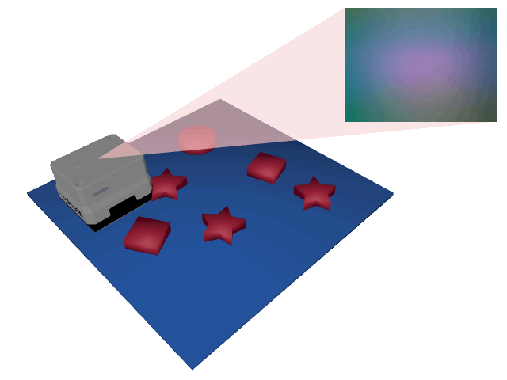

# Tactile MNIST Dataset

This repository contains code to access the Tactile MNIST simulated benchmark tasks and datasets, as further described on our [project page](https://sites.google.com/robot-learning.de/tactile-mnist/), which also links to the paper.

## Installation

This package can be installed using pip:

```bash
pip install .[OPTIONS]
```

where OPTIONS can be any number of the following (comma separated):

- `examples`: installs dependencies for the examples.
- `torch`, `jax`, and `jax-cpu`: installs dependencies for the interactive Tactile MNIST environment with PyTorch, JAX, or JAX without CUDA support, respectively. Without any of those options, the interactive environment cannot be used but the static datasets will still work.

If you are seeing errors as such

```
OSError: [...]/torch_scatter/_version_cpu.so: undefined symbol: _ZN3c1017RegisterOperatorsD1Ev
```

then there are CUDA version incompatibilities between `torch_scatter`, PyTorch, and `nvcc`.

If you are seeing errors as such

```
RuntimeError: Not compiled with CUDA support
```

then `nvcc` was not found when installing `torch_scatter`.

In both cases, follow the instructions in the [official torch_scatter repository](https://github.com/rusty1s/pytorch_scatter) to install compatible PyTorch and `torch_scatter` versions.

## Contents

This package provides [ap_gym](https://github.com/TimSchneider42/active-perception-gym) environments for two simulated [active tactile classification benchmark tasks](#benchmark) and access to the [Tactile MNIST datasets](#datasets).
The ap_gym environments can be used to train and evaluate agents on active tactile perception problems on simulated data and are further described in the [Benchmark section](#benchmark).
In the Tactile MNIST datasets, you find two datasets of 3D CAD models, _MNIST 3D_ and _Starstruck_, and three datasets of tactile images, _Synthetic Tactile MNIST_, _Real Tactile MNIST_, and _Synthetic Tactile Starstruck_.
This package provides an easy way of loading and working with these datasets, as further described in the [Datasets section](#datasets).

## Simulated Active Tactile Perception Benchmark

<table align="center" style="border-collapse: collapse; border: none;">
    <tr style="border: none;">
        <td align="center" style="border: none; padding: 10px;">
            <br/>
            <a href="doc/TactileMNIST.md">
                TactileMNIST-v0
            </a>
        </td>
        <td align="center" style="border: none; padding: 10px;">
            <br/>
            <a href="doc/Starstruck.md">
                MNIST-v0
            </a>
        </td>
    </tr>
</table>

We provide an [ap_gym](https://github.com/TimSchneider42/tactile-mnist) environment for the _Active Tactile MNIST Classification Task_.
The environment can be used to train and evaluate agents on an active tactile classification problem on simulated data.

Here is an example of how to use the environment:

```python
from tactile_mnist import TactileClassificationEnv, MeshDataset, get_resource
import numpy as np

env = TactileClassificationEnv(MeshDataset.load(get_resource("remote:mnist3d_split_v0/train")))

env.reset()
for i in range(10):
    action = {
        "action": {
            "sensor_target_pos_rel": np.random.uniform(-1, 1, size=3),
            "sensor_target_rot_rel": np.random.uniform(-1, 1, size=6),
        },
        "prediction": np.ones(10)
    }

    obs, _, _, _, info = env.step(action)
    sensor_img = obs["sensor_image"]  # 240 x 320 x 3 tactile image
    sensor_pos = obs["sensor_pos"]  # normalized 3D sensor position
    sensor_rot = obs["sensor_rot"]  # 6D sensor orientation
    ground_truth_label = info["label"]  # integer ground truth label of the object
```

In this environment, the agent controls the position and orientation of a tactile sensor, which it can move around above the sensor.
Once `env.step` is called, the sensor will be moved by the position delta specified in `action["action"]["sensor_target_pos_rel"]` and the orientation delta specified in `action["action"]["sensor_target_rot_rel"]` and moved towards the target position until it gets in contact with the object or the cell surface.
Then, in the next observation, the agent will receive a tactile image of the object along with the actual final 3D position and orientation of the sensor.

The objective of the agent is to predict the label of the object, which it does by setting `action["prediction"]` to the respective logits.
In every step, it receives the negative cross entropy loss between its prediction and the ground truth label plus an action regularization as a reward.
Hence, the agent has to use the tactile images to both predict the label of the object and to decide where to conduct the next touch.

We model 3D orientations as 6D vectors as suggested by [Zhou et al](https://openaccess.thecvf.com/content_CVPR_2019/html/Zhou_On_the_Continuity_of_Rotation_Representations_in_Neural_Networks_CVPR_2019_paper.html).
Unlike this work though, we include the second and third column of the rotation matrix instead of the first and second, as it helps us to ensure that the sensor only receives downwards pointing target orientations.

For an example usage of `TactileClassificationEnv`, see `example/tactile_mnist_env_example.py`.

## Datasets

This package provides the following datasets:

- **[3D Mesh Datasets](#3d-mesh-datasets)**:
    1. **MNIST 3D**: a dataset of 3D models generated from a [high-resolution version of the MNIST dataset](https://arxiv.org/abs/2011.07946).
    2. **Starstruck**: a dataset in which the number of stars in a scene have to be counted (3 classes, 1 - 3 stars per scene).
- **[Touch Datasets](#touch-datasets)**
    1. **Synthetic Tactile MNIST**: a dataset of synthetic tactile images generated from the _MNIST 3D_ dataset with the [Taxim simulator](https://arxiv.org/abs/2109.04027).
    2. **Real Tactile MNIST**: a dataset of real tactile images of 3D printed _MNIST 3D_ digits collected with a Franka robot.
    3. **Synthetic Tactile Starstruck**: a dataset of synthetic tactile images generated from the _Starstruck_ dataset with the [Taxim simulator](https://arxiv.org/abs/2109.04027).

All data can be found [https://archimedes.ias.informatik.tu-darmstadt.de/s/EiFPmyqa34DLF8S](here), though this package will download and cache the required files automatically when needed.

### 3D Mesh Datasets

The _MNIST 3D_ and _Starstruck_ datasets can be accessed by creating an instance of `MeshDataset`:

```python
from tactile_mnist import MeshDataset, get_resource

mnist_3d_dataset = MeshDataset.load(get_resource("remote:mnist3d_split_v0/train"))
starstruck_dataset = MeshDataset.load(get_resource("remote:starstruck_split_v0/train"))
```

Next to the `train` split, the `test`, `holdout`, `printed_train`, and `printed_test` splits are also available for _MNIST 3D_.
The latter two contain meshes of the digits that were 3D printed and used to collect the _Real Tactile MNIST_ dataset.

`MeshDataset` is indexable and loads meshes lazily, so it does not require much memory.
For example, to get the first data point in the dataset:

```python
data_point = mnist_3d_dataset[0]
```

Each data point has the following fields:

- `mesh`: a `trimesh.Trimesh` object containing the mesh of the digit.
- `metadata`: metadata of the data point
    - `id`: the ID of the data point (from the original high resolution MNIST dataset).
    - `label`: the label of the data point (0-9).

`MeshDataset` is also iterable, so you can use it in a for loop:

```python
for data_point in mnist_3d_dataset:
    print(f"Datapoint {data_point.metadata.id}")
    data_point.mesh.show()  # data_point.mesh is a trimesh.Trimesh object
```

If you wish to view a dataset, you can take a look at the [example/view_mesh_dataset.py](example/view_mesh_dataset.py) script.
Check out the [Advanced Dataset Usage](#advanced-dataset-usage) section for a comprehensive overview of the features of `MeshDataset`.

#### Available 3D Mesh Datasets

Currently, the following 3D mesh datasets are available:

| Name                              | Description                                                                                                                                                                               |
|-----------------------------------|-------------------------------------------------------------------------------------------------------------------------------------------------------------------------------------------|
| _mnist_3d_v0_                     | 3D models generated from a [high-resolution version of the MNIST dataset](https://arxiv.org/abs/2011.07946).                                                                              |
| _mnist_3d_split_v0/train_         | Training split of _mnist_3d_v0_.                                                                                                                                                          |
| _mnist_3d_split_v0/test_          | Test split of _mnist_3d_v0_.                                                                                                                                                              |
| _mnist_3d_split_v0/printed_train_ | Training split of the digits that were 3D printed and used to collect the _Real Tactile MNIST_ dataset. Corresponds to the touch data in _tactile_mnist_real_[seq/single]_t256_v0/train_. |
| _mnist_3d_split_v0/printed_test_  | Test split of the digits that were 3D printed and used to collect the _Real Tactile MNIST_ dataset. Corresponds to the touch data in _tactile_mnist_real_[seq/single]_t256_v0/test_.      |
| _mnist_3d_split_v0/holdout_       | Holdout split of _mnist_3d_v0_.                                                                                                                                                           |
| _starstruck_v0_                   | A dataset in which the number of stars in a scene have to be counted (3 classes, 1 - 3 stars per scene).                                                                                  |
| _starstruck_split_v0_/train       | Training split of _starstruck_v0_.                                                                                                                                                        |
| _starstruck_split_v0_/test        | Test split of _starstruck_v0_.                                                                                                                                                            |

### Touch datasets

To access the touch datasets, you can use the `TouchDataset` class:

```python
from tactile_mnist import TouchDataset, get_resource

dataset = TouchDataset(get_resource("remote:DATASET_NAME/SPLIT_NAME"))

with dataset as loaded_dataset:
    # Do something with the dataset
    data_point = loaded_dataset[0]
```

The context manager (`with dataset as loaded_dataset`) loads the dataset's metadata, while the memory intensive images in the dataset are by default loaded lazily once they are indexed.
If you wish to trade memory efficiency for performance, you can instruct `TouchDataset` to load the full data points into memory instead:

```python
dataset = TouchDataset(get_resource("remote:DATASET_NAME/SPLIT_NAME"), mode="in_memory")
```

Loading full data points into memory requires much more space, but can yield substantial speed-ups, especially if you are using HDDs or plan to request data points more than once.

#### Datapoint Structure

Tactile MNIST contains two types of touch datasets: _image sequence_ (_seq_) datasets and _single image_ (_single_) datasets.
In _image sequence_ datasets, each data point is a short video sequence of the sensor being pressed in the object, while _single image_ data points contain just a single snapshot of a touch.
Depending on the type of dataset (_seq_ or _single_), the data points have different fields:

**_seq_ datasets**: each data point is a sequence of tactile images, from the moment the robot starts pressing down on
the digit until it has retracted its end effector again.

- `sensor_image_seq`: `np.ndarray` containing a sequence of tactile images (shape N x 240 x 320 x 3, where N is the
  sequence length).
- `metadata`: metadata of the data point
    - `label`: the label of the data point (0-9).
    - `pos_in_cell`: the intended 2D position of the touch in the cell frame (in meters).
    - `object_id`: the ID of the data point (from the original high resolution MNIST dataset).
    - `round_id`: the ID of the round in which the data point was collected.
    - `touch_no`: the ID of the touch in the round.
    - `info`: additional information about the data point (e.g. the ID of the gel used to collect it).
    - `touch_start_time_rel`: time stamp of the first registered contact with the object (in seconds).
    - `touch_end_time_rel`: time stamp of the last registered contact with the object (in seconds).
    - `time_stamp_rel_seq`: time stamps of the individual frames in the sequence (in seconds).
    - `gel_position_cell_frame_seq`: full actual 3D position of the gel in the cell frame for each frame in the sequence (in
      meters).
    - `gel_orientation_cell_frame_seq`: full actual 3D orientation of the gel in the cell frame for each frame in the
      sequence (as a quaternion; x, y, z, w).

**_single_ datasets**: each data point is a single tactile image, extracted from the corresponding _seq_ dataset by `touch_dataset/touch_dataset_to_single.py`.

- `sensor_image`: `np.ndarray` containing a single tactile image (shape 240 x 320 x 3).
- `metadata`: metadata of the data point
    - `label`: the label of the data point (0-9).
    - `pos_in_cell`: the intended 2D position of the touch in the cell frame (in meters).
    - `object_id`: the ID of the data point (from the original high resolution MNIST dataset).
    - `round_id`: the ID of the round in which the data point was collected.
    - `touch_no`: the ID of the touch in the round.
    - `info`: additional information about the data point (e.g. the ID of the gel used to collect it).
    - `gel_position_cell_frame`: full actual 3D position of the gel in the cell frame (in meters).
    - `gel_orientation_cell_frame`: full actual 3D orientation of the gel in the cell frame (as a quaternion; x, y, z, w).

Here, a round is defined as a sequence of touches on the same object, during which the object might move due to the touches but is otherwise not externally influenced.
A touch is a single press with the robot's end effector on the object.

The coordinate frame of each cell is in its center, with the x-axis pointing to the right of the robot, the y-axis pointing away from the robot, and the z-axis pointing up, orthogonal to the cell surface.

#### Using Tactile MNIST datasets

For training, it might be necessary to group the touches by round.
To do this, you can use the `BaseTouchDataset.rounds` property, which returns a dictionary mapping from round IDs to a dataset of touches in that round.

```python
with dataset as loaded_dataset:
    for round_id, round_data in loaded_dataset.rounds:
        # round_data is a touch dataset

        # Iterate over the touches in the round
        for touch in round_data:
            # Do something with the touch
            pass
```

We also provide a `TouchDatasetRoundIterator` class, which can be used to iterate over the rounds in multiple datasets.

```python
from tactile_mnist import TouchDatasetRoundIterator, TouchDataset, get_resource

datasets = TouchDataset.load_all(get_resource("remote:tactile_mnist_syn_single_t32_v1/train"))
for round_data in TouchDatasetRoundIterator(datasets, dataset_prefetch_count=1, shuffle=True):
    # round_data is a touch dataset
    # Iterate over the touches in the round
    for touch in round_data:
        # Do something with the touch
        pass
```

`TouchDatasetRoundIterator` takes care of loading and unloading datasets and supports both shuffling and thread-based prefetching of datasets.

#### Synthetic Tactile MNIST

Using the [Taxim simulator](https://arxiv.org/abs/2109.04027), we generate synthetic touches from the _MNIST 3D_ dataset.
Touch positions were sampled uniformly from 2D cell coordinates, while the orientation of the sensor was kept fixed, parallel to the cell surface.
All code related to synthetic data generation can be found in `data_collection/synthetic`.

Currently, the following _synthetic_ datasets are available:

- _tactile_mnist_syn_08_single_t32_v0_: _single_ dataset consisting of touches of 0's and 8's only, with 32 touches per round. In total 19328 rounds (=618496 touches) training data and 1600 rounds (=51200 touches) test data per label.
- _tactile_mnist_syn_single_t32_v0_: _single_ dataset consisting of touches of all 10 digits, with 32 touches per round. In total 19328 rounds (=618496 touches) training data and 1600 rounds (=51200 touches) test data per label.
- _tactile_mnist_syn_single_t32_v1_: version 1 of _tactile_mnist_syn_single_t32_v0_ with new Taxim calibration.

#### Real Tactile MNIST

Using a Franka robot, we collected 153600 real tactile touches of 3D printed digits from the _MNIST 3D_ dataset.
For each touch, the robot's end effector was pressed down on the digit, and, once the measured force exceeded 5N, retracted again.
Touch positions were sampled uniformly from 2D cell coordinates, while the orientation of the sensor was kept fixed, parallel to the cell surface.
After collecting half of the touches, the gel was replaced with a new one.

All code related to real data collection can be found in `data_collection/real`.

Currently, the following _real_ datasets are available:

- _tactile_mnist_real_seq_t256_v0_: _seq_ dataset consisting of touches of all digits, with 256 touches per round. In total 50 rounds (=12800 touches) training data and 10 rounds (=2560 touches) test data per label.
- _tactile_mnist_real_single_t256_v0_: _single_ version of _tactile_mnist_real_seq_t256_v0_.

#### Synthetic Tactile Starstruck

The _Synthetic Tactile Starstruck_ dataset was generated similar to the _Synthetic Tactile MNIST_ using the [Taxim simulator](https://arxiv.org/abs/2109.04027).

Currently, the following dataset is available:

- _tactile_starstruck_syn_single_t32_v0_: _single_ dataset consisting of touches of the _Starstruck_ dataset, with 32 touches per round. In total 16000 rounds (=512000 touches) training data and 1600 rounds (=51200 touches) test data per label.

### Advanced Dataset Usage

`MeshDataset` and `LoadedTouchDataset` inherit from `Dataset`, which provides some useful functionality for working
with the datasets.

#### Indexing

`Dataset` is indexable, so you can use the `[]` operator to get a data point from the dataset:

```python
data_point = dataset[0]
```

You can also use slicing to get a subset of the dataset:

```python
subset = dataset[0:10]
```

This will return a new `Dataset` object containing the subset of the original dataset.

Finally, you can use a list of indices to get a subset of the dataset:

```python
subset = dataset[[0, 1, 8, 9]]
```

Crucially, no datapoint will be loaded when using slices or index lists to create subsets, making these operations very
efficient.

```python
subset = dataset[0:10]  # No data points are loaded here
data_point = subset[0]  # Only the first data point is loaded here
```

The length of the dataset can be obtained using the `len` function:

```python
length = len(dataset)
```

#### Iteration

Dataset is iterable, so you can use it in a for loop:

```python
for data_point in dataset:
# Do something with the data point
```

#### Concatenating Datasets

Two or more datasets can be concatenated using `Dataset.concatenate` or the `+` operator:

```python
concatenated_dataset = Dataset.concatenate(dataset_1, dataset_2, dataset_3)

# Or (equivalent but less efficient):
concatenated_dataset = dataset_1 + dataset_2 + dataset_3
```

#### Viewing datapoint metadata without loading them

You can view the metadata of data points without loading them fully using the `Dataset.partial` property:

```python
dp_metadata = dataset.partial[0]

# Equivalent to, but much more efficient than:
dp_metadata = dataset[0].metadata
```
