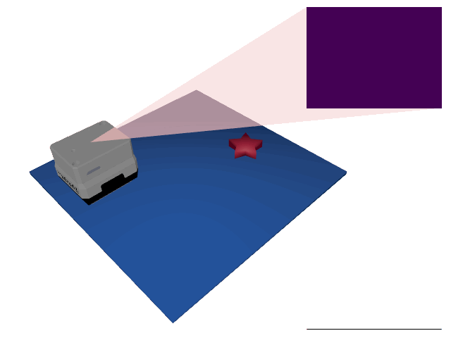

# Starstruck

<p align="center"></p>

This environment is part of the tactile classification environments.
Refer to the [tactile classification environments overview](TactileClassificationEnv.md) for a general description of these environments.

|                              |                                         |
|------------------------------|-----------------------------------------|
| **Environment ID**           | Starstruck-v0                           |
| **Dataset**                  | [Starstruck](datasets.md#starstruck) |
| **Number of classes**        | 3                                       |
| **Step limit**               | 32                                      |
| **Sensor rotation**          | disabled                                |
| **Object pose perturbation** | disabled                                |

## Description

In the _Starstruck_ environment, the agent must count the number of stars in a scene cluttered with other objects.
Since all stars look the same, distinguishing stars from the other objects is rather straightforward.
Instead, the main challenge posed in this environment is to learn an effective search strategy to systematically cover as much space as possible.

## Example Usage

```python
import ap_gym

env = ap_gym.make("Starstruck-v0")

# Or for the vectorized version with 4 environments:
envs = ap_gym.make_vec("Starstruck-v0", num_envs=4)
```

## Version History

- `v0`: Initial release.

## Variants

| Environment ID            | Description                                                                                         | Preview                                                                                        |
|---------------------------|-----------------------------------------------------------------------------------------------------|------------------------------------------------------------------------------------------------|
| Starstruck-train-v0       | Alias for Starstruck-v0.                                                                            |                        |
| Starstruck-test-v0        | Uses the test split of _Starstruck_ instead of the train split.                                     |              |
| Starstruck-Depth-train-v0 | Uses a depth image instead of rendering tactile images.                                             |            |
| Starstruck-Depth-test-v0  | Same as Starstruck-Depth-train-v0 but uses the test split of _MNIST 3D_ instead of the train split. |  |
