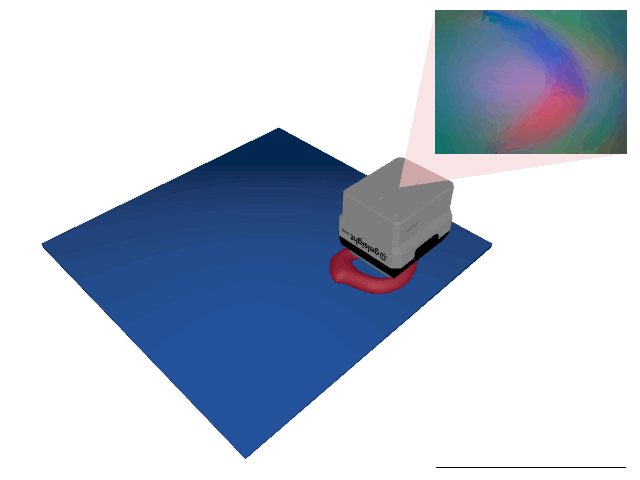

# Tactile Classification Environments

In tactile classification environments, the agent has to classify a 3D object by exploring it with a [GelSight Mini](https://www.gelsight.com/gelsightmini/) tactile sensor.
The agent does not have access to the object's location or orientation and also receives no visual input.
Instead, it must actively control the sensor to find and classify the object.

For more details on tactile perception environments in general, see the [Tactile Perception Environments documentation](TactilePerceptionEnv.md).

Currently implemented are the following two tasks, which are described in more detail in their respective documentations:

    <table style="border-collapse: collapse; border: none;">
        <tr style="border: none;">
            <td align="center" style="border: none; padding: 10px;">
                 
                <a href="TactileMNIST.md">
                    TactileMNIST-v0
                </a>
            </td>
            <td align="center" style="border: none; padding: 10px;">
                 
                <a href="Starstruck.md">
                    Starstruck-v0
                </a>
            </td>
        </tr>
    </table>

All tactile classification environments are instantiations of the `tactile_mnist.TactileClassificationVectorEnv` class and share the following properties:

## Properties

<table>
    <tr>
        <td><strong>Prediction Space</strong></td>
        <td><code>Box(-inf, inf, shape=(K,), dtype=np.float32)</code></td>
    </tr>
    <tr>
        <td><strong>Prediction Target Space</strong></td>
        <td><code>Discrete(K)</code></td>
    </tr>
    <tr>
        <td><strong>Loss Function</strong></td>
        <td>
            <code>ap_gym.CrossEntropyLossFn()</code>
        </td>
    </tr>
</table>

where $K \in \mathbb{N}$ is the number of classes in the environment.

## Prediction Space

The prediction is a $K$-element `np.ndarray` containing the logits of the agent's prediction w.r.t. the class label.

## Prediction Target Space

The prediction target is a scalar integer in the range $[0, K - 1]$, representing the true class.

## Arguments

| Parameter     | Type                            | Default       | Description                                                                                                                                   |
|---------------|---------------------------------|---------------|-----------------------------------------------------------------------------------------------------------------------------------------------|
| `config`      | `TactilePerceptionConfig`       |               | Configuration of the tactile perception environment. See the [TactilePerceptionConfig documentation](TactilePerceptionConfig.md) for details. |
| `num_envs`    | `int`                           |               | Number of parallel environments to create.                                                                                                    |
| `render_mode` | `Literal["rgb_array", "human"]` | `"rgb_array"` | Which render mode to use.                                                                                                                     |

## Overview of Implemented Environments

| Environment ID                     | Dataset                                 | # classes | Step Limit | Sensor Rotation | Object Pose Perturbation | Description                                   |
|------------------------------------|-----------------------------------------|-----------|------------|-----------------|--------------------------|-----------------------------------------------|
| [TactileMNIST-v0](TactileMNIST.md) | [MNIST 3D](datasets.md#mnist-3d)      | 10        | 16         | disabled        | enabled                  | Classify objects from the _MNIST 3D_ dataset. |
| [Starstruck-v0](Starstruck.md)     | [Starstruck](datasets.md#starstruck) | 3         | 32         | disabled        | disabled                 | Count the number of stars in the scene.       |
