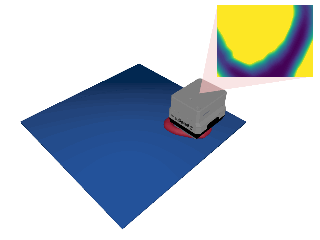

# TactileMNISTVolume

<p align="center"></p>

This environment is part of the tactile regression environments.
Refer to the [tactile regression environments overview](TactileRegressionEnv.md) for a general description of these environments.

|                              |                                    |
|------------------------------|------------------------------------|
| **Environment ID**           | TactileMNISTVolume-v0              |
| **Dataset**                  | [MNIST 3D](datasets.md#mnist-3d) |
| **Prediction Dimensions**    | 1                                  |
| **Step limit**               | 32                                 |
| **Sensor rotation**          | disabled                           |
| **Object pose perturbation** | enabled                            |

## Description

In the TactileMNISTVolume environment, the agent's objective is to estimate the volume of 3D models of handwritten digits by touch alone.
aside from finding the object, the main challenge in the TactileMNISTVolume environment is to learn contour following strategies to efficiently explore it once found.
Object pose perturbation is enabled, meaning that the object shifts around slightly while being touched.
This requires the agent to use robust strategies that are invariant to small shifts in the object's pose.

## Prediction Target Space

The prediction target is a 1-element `np.ndarray` containing the volume of the object.
We normalize the object volumes to have a mean of 0 and a standard deviation of 1 across the training set.
In case of MNIST 3D, the normalization parameters are as follows:
- Mean: 4.659 cm $^3$
- Standard Deviation: 2.870 cm $^3$

Note that when running the environment for the first time, computing these values from the training dataset might take some time.
However, this is only done once and the values are cached for future runs.

## Example Usage

```python
import ap_gym

env = ap_gym.make("TactileMNISTVolume-v0")

# Or for the vectorized version with 4 environments:
envs = ap_gym.make_vec("TactileMNISTVolume-v0", num_envs=4)
```

## Version History

- `v0`: Initial release.

## Variants

| Environment ID                       | Description                                                                                                                                                                             | Preview                                                                                                              |
|--------------------------------------|-----------------------------------------------------------------------------------------------------------------------------------------------------------------------------------------|----------------------------------------------------------------------------------------------------------------------|
| TactileMNISTVolume-train-v0          | Alias for TactileMNISTVolume-v0.                                                                                                                                                        |                              |
| TactileMNISTVolume-test-v0           | Uses the test split of _MNIST 3D_ instead of the train split.                                                                                                                           |                    |
| TactileMNISTVolume-CycleGAN-train-v0 | Uses a [CycleGAN](https://junyanz.github.io/CycleGAN/) trained on data points from the [Real Tactile MNIST](#real-tactile-mnist) dataset instead of Taxim to render the tactile images. |            |
| TactileMNISTVolume-CycleGAN-test-v0  | Same as TactileMNISTVolume-CycleGAN-train-v0 but uses the test split of _MNIST 3D_ instead of the train split.                                                                          |  |
| TactileMNISTVolume-Depth-train-v0    | Uses a depth image instead of rendering tactile images.                                                                                                                                 |                  |
| TactileMNISTVolume-Depth-test-v0     | Same as TactileMNISTVolume-Depth-train-v0 but uses the test split of _MNIST 3D_ instead of the train split.                                                                             |        |
