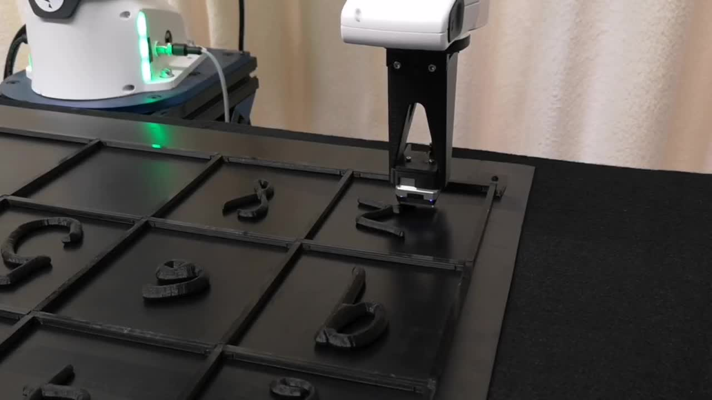

# Datasets

This package provides the following datasets:

- **[3D Mesh Datasets](#3d-mesh-datasets)**:
    1. **MNIST 3D**: a dataset of 3D models generated from a [high-resolution version of the MNIST dataset](https://arxiv.org/abs/2011.07946).
    2. **Starstruck**: a dataset in which the number of stars in a scene have to be counted (3 classes, 1 - 3 stars per scene).
- **[Touch Datasets](#touch-datasets)**
    1. **Synthetic Tactile MNIST**: a dataset of synthetic tactile images generated from the _MNIST 3D_ dataset with the [Taxim simulator](https://arxiv.org/abs/2109.04027).
    2. **Real Tactile MNIST**: a dataset of real tactile images of 3D printed _MNIST 3D_ digits collected with a Franka robot.
    3. **Synthetic Tactile Starstruck**: a dataset of synthetic tactile images generated from the _Starstruck_ dataset with the [Taxim simulator](https://arxiv.org/abs/2109.04027).

All data is hosted on [Huggingface](https://huggingface.co/TimSchneider42), though this package will download and cache the required files automatically when needed.

## 3D Mesh Datasets

The _MNIST 3D_ and _Starstruck_ datasets can be accessed by creating an instance of `MeshDataset`:

```python
from datasets import load_dataset
from tactile_mnist import MeshDataset

mnist_3d_dataset = MeshDataset(load_dataset("TimSchneider42/tactile-mnist-mnist3d", split="train"))
starstruck_dataset = MeshDataset(load_dataset("TimSchneider42/tactile-mnist-starstruck", split="train"))
```

Next to the `train` split, the `test`, `holdout`, `printed_train`, and `printed_test` splits are also available for _MNIST 3D_.
The latter two contain meshes of the digits that were 3D printed and used to collect the _Real Tactile MNIST_ dataset.
A detailed list of available datasets can be found in the [Available 3D Mesh Datasets](#available-3d-mesh-datasets) section.

`MeshDataset` is indexable and loads data points lazily, so it does not require much memory.
For example, to get the first data point in the dataset:

```python
data_point = mnist_3d_dataset[0]
```

Each data point has the following fields:

- `id`: the ID of the data point (from the original high resolution MNIST dataset).
- `label`: the label of the data point (0-9).
- `mesh`: a `trimesh.Trimesh` object containing the mesh of the digit.

Datapoints itself also load their fields lazily, so metadata can be accessed without having to load the mesh.

```python
# This does not load the mesh of datapoint 0
mnist_3d_dataset[0].id

# Here it gets loaded on the fly and cached for future use
mnist_3d_dataset[0].mesh
```

`MeshDataset` also supports streaming:

```python
from datasets import load_dataset
from tactile_mnist import MeshDataset

mnist_3d_dataset = MeshDataset(load_dataset("TimSchneider42/tactile-mnist-mnist3d", split="train", streaming=True))

for data_point in mnist_3d_dataset:
    print(f"Datapoint {data_point.id}")
    data_point.mesh.show()  # data_point.mesh is a trimesh.Trimesh object
```

If you wish to view a dataset, you can take a look at the [example/view_mesh_dataset.py](example/view_mesh_dataset.py) script.
Check out the [Advanced Dataset Usage](#advanced-dataset-usage) section for a comprehensive overview of the features of `MeshDataset`.

### Available 3D Mesh Datasets

Currently, the following 3D mesh datasets are available:

#### MNIST 3D

<p align="center">
  
  
  
  
</p>

3D models generated from a [high-resolution version of the MNIST dataset](https://arxiv.org/abs/2011.07946).

| Split           | Description                                                                                                                                                                                      |
|-----------------|--------------------------------------------------------------------------------------------------------------------------------------------------------------------------------------------------|
| `train`         | Training split of *mnist3d*.                                                                                                                                                                     |
| `test`          | Test split of *mnist3d*.                                                                                                                                                                         |
| `printed_train` | Training split of the digits that were 3D printed and used to collect the *Real Tactile MNIST* dataset. Corresponds to the touch data in *tactile-mnist-touch-real-[seq/single]-t256-.../train*. |
| `printed_test`  | Test split of the digits that were 3D printed and used to collect the *Real Tactile MNIST* dataset. Corresponds to the touch data in *tactile-mnist-touch-real-[seq/single]-t256-.../test*.      |
| `holdout`       | Holdout split of *mnist3d*.                                                                                                                                                                      |

Available on Huggingface: [TimSchneider42/tactile-mnist-mnist3d](https://huggingface.co/datasets/TimSchneider42/tactile-mnist-mnist3d).

#### Starstruck

<p align="center">
  
  
  
  
</p>

A dataset in which the number of stars in a scene must be counted (3 classes, 1–3 stars per scene).

| Split   | Description                     |
|---------|---------------------------------|
| `train` | Training split of *starstruck*. |
| `test`  | Test split of *starstruck*.     |

Available on Huggingface: [TimSchneider42/tactile-mnist-starstruck](https://huggingface.co/datasets/TimSchneider42/tactile-mnist-starstruck).

## Touch datasets

To access the touch datasets, you can use the `TouchSingleDataset` and `TouchSeqDataset` classes:

```python
from datasets import load_dataset
from tactile_mnist import TouchSingleDataset, TouchSeqDataset

# For datasets of the "single" type (i.e., dataset that contain a single image per touch), use TouchSingleDataset
dataset_single = TouchSingleDataset(
    load_dataset("TimSchneider42/tactile-mnist-touch-real-single-t256-320x240", split="train")
)
# For datasets of the "seq" type (i.e., dataset that contain a video per touch), use TouchSeqDataset
dataset_seq = TouchSeqDataset(
    load_dataset("TimSchneider42/tactile-mnist-touch-real-seq-t256-320x240", split="train")
)

# Do something with the datasets
data_point_single = dataset_single[0]
data_point_seq = dataset_seq[0]
```

Both `TouchSingleDataset` and `TouchSeqDataset` work exactly like `MeshDataset`, in that they load lazily, are indexable, and support streaming.
For more details on how to use them, refer to the [Advanced Dataset Usage](#advanced-dataset-usage) section.

See [Available Touch Datasets](#available-touch-datasets) for a list of available touch datasets.
For a more complete example of how to use the touch datasets, refer to [example/view_touch_dataset.py](example/view_touch_dataset.py).

### Datapoint Structure

Tactile MNIST contains two types of touch datasets: _image sequence_ (_seq_) datasets and _single image_ (_single_) datasets.
In both cases, a data point refers to a number of $T$ touches conducted on a single object.
$T$ is denoted in the name of the dataset (e.g. `tactile-mnist-touch-real-single-t256-320x240` contains 256 touches per round).
Here, a round is defined as a sequence of touches on the same object, during which the object might move due to the touches but is otherwise not externally influenced.
A touch is a single press with the robot's end effector on the object.
In _image sequence_ datasets, each touch of the data point is a short video sequence of the sensor being pressed in the object, while _single image_ data points contain just a single snapshot of each touch.

Depending on the type of dataset (_seq_ or _single_), the data points have different fields:

**_seq_ datasets**: each data point has a list of video sequences of tactile images, from the moment the robot starts pressing down on the digit until it has retracted its end effector again.

- `id`: The ID of this data point.
- `label`: The label of the data point (0-9).
- `object_id`: The ID of the data point (from the original high resolution MNIST dataset).
- `info`: Additional information about the data point (e.g. the ID of the gel used to collect it).
- `pos_in_cell`: $T \times 2$ `np.ndarray` of the intended 2D position of each touch in the cell frame (in meters).
- `video_length_frames`: List of length $T$ with the number of frames in the video (=N).
- `time_stamp_rel_seq`: List of length $T$ of lists of length $N_i$ of the time stamps of the individual frames in the sequence, relative to the start of the sequence as `datetime.timedelta`. This information should be similar to the timing information in the `sensor_video` field, but it was taken from the system clock in the exact moment the frame was retrieved.
- `touch_start_time_rel`: List of length $T$ of the time stamp of the first registered contact with the object (in seconds).
- `touch_end_time_rel`: List of length $T$ of the time stam of the last registered contact with the object (in seconds).
- `gel_pose_cell_frame_seq`: List of length $T$ of lists of length $N_i$ of the full actual 3D pose of the gel in the cell frame for each frame in the sequence as `transformation.Transformation`.
- `sensor_video`: List of length $T$ of `torchvision.io.VideoReader`, each containing a video sequence of tactile images of length $N_i$.

**_single_ datasets**: each data point is a single tactile image, extracted from the corresponding _seq_ dataset by `touch_dataset/touch_dataset_to_single.py`.

- `id`: The ID of this data point.
- `label`: The label of the data point (0-9).
- `object_id`: The ID of the data point (from the original high resolution MNIST dataset).
- `info`: Additional information about the data point (e.g. the ID of the gel used to collect it).
- `pos_in_cell`: $T \times 2$ `np.ndarray` of the intended 2D position of each touch in the cell frame (in meters).
- `gel_pose_cell_frame`: List of length $T$ of the full actual 3D pose of the gel in the cell frame at touch time as `transformation.Transformation`.
- `sensor_image`: `np.ndarray` containing the tactile image of the touch.

The coordinate frame of each cell is in its center, with the x-axis pointing to the right of the robot, the y-axis pointing away from the robot, and the z-axis pointing up, orthogonal to the cell surface.

### Available Touch Datasets

This package provides three classes of touch datasets: [Real Tactile MNIST](#real-tactile-mnist), [Synthetic Tactile MNIST](#synthetic-tactile-mnist), and [Synthetic Tactile Starstruck](#synthetic-tactile-starstruck).
Each class contains multiple datasets and each dataset has a training (`train`) and test (`test`) split.

| Name                                                                                                                                                          | 3D Model Dataset | Type     | # Rounds         | # Touches / Round | Sensor Resolution | Description                                                                                                                                                                                                | Preview                                                                                                                                                      |
|---------------------------------------------------------------------------------------------------------------------------------------------------------------|------------------|----------|------------------|-------------------|-------------------|------------------------------------------------------------------------------------------------------------------------------------------------------------------------------------------------------------|--------------------------------------------------------------------------------------------------------------------------------------------------------------|
| [tactile-mnist-touch-real-seq-t256-320x240](https://huggingface.co/datasets/TimSchneider42/tactile-mnist-touch-real-seq-t256-320x240)                         | MNIST 3D         | _seq_    | 500 / 100        | 256               | 320 x 240         | Real tactile images of 3D printed _MNIST 3D_ digits collected with a Franka robot. The `train` and `test` splits of this dataset corresponds to the `printed_train` and `printed_test` splits of MNIST 3D. |                           |
| [tactile-mnist-touch-real-single-t256-320x240](https://huggingface.co/datasets/TimSchneider42/tactile-mnist-touch-real-single-t256-320x240)                   | MNIST 3D         | _single_ | 500 / 100        | 256               | 320 x 240         | _Single_ version of `tactile-mnist-touch-real-seq-t256-320x240`                                                                                                                                            |                    |
| [tactile-mnist-touch-real-single-t256-64x64](https://huggingface.co/datasets/TimSchneider42/tactile-mnist-touch-real-single-t256-64x64)                       | MNIST 3D         | _single_ | 500 / 100        | 256               | 64 x 64           | `tactile-mnist-touch-real-single-t256-320x240` scaled to a 64x64 resolution.                                                                                                                               |                        |
| [tactile-mnist-touch-syn-single-t32-320x240](https://huggingface.co/datasets/TimSchneider42/tactile-mnist-touch-syn-single-t32-320x240)                       | MNIST 3D         | _single_ | 193,280 / 16,000 | 32                | 320 x 240         | Synthetic tactile images generated from the _MNIST 3D_ dataset with the Taxim simulator.                                                                                                                   |                        |
| [tactile-mnist-touch-syn-single-t32-64x64](https://huggingface.co/datasets/TimSchneider42/tactile-mnist-touch-syn-single-t32-64x64)                           | MNIST 3D         | _single_ | 193,280 / 16,000 | 32                | 64 x 64           | `tactile-mnist-touch-syn-single-t32-320x240` scaled to a 64x64 resolution.                                                                                                                                 |                            |
| [tactile-mnist-touch-starstruck-syn-single-t32-320x240](https://huggingface.co/datasets/TimSchneider42/tactile-mnist-touch-starstruck-syn-single-t32-320x240) | Starstruck       | _single_ | 16,000 / 1,600   | 32                | 320 x 240         | Synthetic tactile images generated from the _Starstruck_ dataset with the Taxim simulator.                                                                                                                 |  |
| [tactile-mnist-touch-starstruck-syn-single-t32-64x64](https://huggingface.co/datasets/TimSchneider42/tactile-mnist-touch-starstruck-syn-single-t32-64x64)     | Starstruck       | _single_ | 16,000 / 1,600   | 32                | 64 x 64           | `tactile-mnist-touch-starstruck-syn-single-t32-320x240` scaled to a 64x64 resolution.                                                                                                                      |      |

For details about the data collection procedure see the [Data Collection](#data-collection) section.

### Tactile Data Collection

In the following, we provide a brief overview of the data collection procedure for the _Real Tactile MNIST_ and _Synthetic Tactile MNIST_ datasets.
For more details, check out our paper linked in our [project page](https://sites.google.com/robot-learning.de/tactile-mnist/).

#### Real Tactile Data Collection

Using a Franka robot, we collected 153,600 real tactile touches of 3D printed digits from the _MNIST 3D_ dataset.
For each touch, the robot's end effector was pressed down on the digit, and, once the measured force exceeded 5N, retracted again.
Touch positions were sampled uniformly from 2D cell coordinates, while the orientation of the sensor was kept fixed, parallel to the cell surface.
After collecting half of the total data points, the gel was replaced with a new one.



#### Synthetic Data Generation

Using the [Taxim simulator](https://arxiv.org/abs/2109.04027), we generate synthetic touches from the _MNIST 3D_ and _Starstruck_ datasets.
Touch positions were sampled uniformly from 2D cell coordinates, while the orientation of the sensor was kept fixed, parallel to the cell surface.

## Advanced Dataset Usage

`MeshDataset`, `TouchSingleDataset`, and `TouchSeqDataset` inherit from `Dataset`, which provides some useful functionality for working
with the datasets.
Crucially, all fields are loaded lazily and cached, so you can use the datasets without worrying about memory usage.
The caches are cleared once the garbage collection cleans up the respective datapoint instance.

### Indexing

`Dataset` is indexable, so you can use the `[]` operator to get a data point from the dataset:

```python
data_point = dataset[0]
```

You can also use slicing to get a subset of the dataset:

```python
subset = dataset[0:10]
```

This will return a new `Dataset` object containing the subset of the original dataset.

Finally, you can use a list of indices to get a subset of the dataset:

```python
subset = dataset[[0, 1, 8, 9]]
```

Crucially, no datapoint will be loaded when using slices or index lists to create subsets, making these operations very
efficient.

```python
subset = dataset[0:10]  # No data points are loaded here
data_point = subset[0]  # Only the first data point is loaded here
```

The length of the dataset can be obtained using the `len` function:

```python
length = len(dataset)
```

### Iteration

Dataset is iterable, so you can use it in a for loop:

```python
for data_point in dataset:
# Do something with the data point
```

### Concatenating Datasets

Two or more datasets can be concatenated using `Dataset.concatenate` or the `+` operator:

```python
concatenated_dataset = Dataset.concatenate(dataset_1, dataset_2, dataset_3)

# Or (equivalent but less efficient):
concatenated_dataset = dataset_1 + dataset_2 + dataset_3
```
