# ABCShape

<p align="center"></p>

This environment is part of the tactile shape reconstruction environments.
Refer to the [tactile shape reconstruction environments overview](TactileShapeReconstructionEnv.md) for a general description of these environments, including their prediction space, prediction target, loss, and metrics.

|                              |                                        |
|------------------------------|----------------------------------------|
| **Environment ID**           | ABCShape-v0                            |
| **Dataset**                  | [ABC Dataset](datasets.md#abc-dataset) |
| **Prediction Dimensions**    | 132                                    |
| **Step limit**               | 32                                     |
| **Sensor rotation**          | enabled                                |
| **Object pose perturbation** | enabled                                |

## Description

In the ABCShape environment, the agent's objective is to reconstruct the full 3D shape of realistic industrial 3D CAD models by touch alone.
Object pose perturbation is enabled, meaning that the object shifts around slightly while being touched.
This requires the agent to use robust strategies that are invariant to small shifts in the object's pose.
The ABCShapeStatic variants disable this perturbation, so the object stays fixed in place for the entire episode, though its initial pose is still randomized.
Unlike the TactileMNISTShape environment, in ABCShape, the objects are much more complex, realistic, and diverse in shape, making it a more challenging task.
For this reason, we allow the agent to rotate the sensor, which can be crucial to effectively explore complex objects.
Note that encoding the object's orientation in the prediction is particularly important in ABCShape, as the models of the ABC dataset have no canonical orientation, so a prediction target in the model frame would not be identifiable from touch observations alone.

## Example Usage

```python
import ap_gym

env = ap_gym.make("ABCShape-v0")

# Or for the vectorized version with 4 environments:
envs = ap_gym.make_vec("ABCShape-v0", num_envs=4)
```

## Version History

- `v0`: Initial release.

## Variants

| Environment ID          | Description                                                                                              | Preview                                                                                    |
|-------------------------|----------------------------------------------------------------------------------------------------------|--------------------------------------------------------------------------------------------|
| ABCShape-train-v0       | Alias for ABCShape-v0.                                                                                   |                        |
| ABCShape-DR-v0 | Same as ABCShape-v0 but with [domain randomization](TactilePerceptionConfig.md#sensor-noise) enabled. ABCShape-DR-train-v0 is an alias for it. |  |
| ABCShape-test-v0        | Uses the test split of the _ABC Dataset_ instead of the train split.                                     | 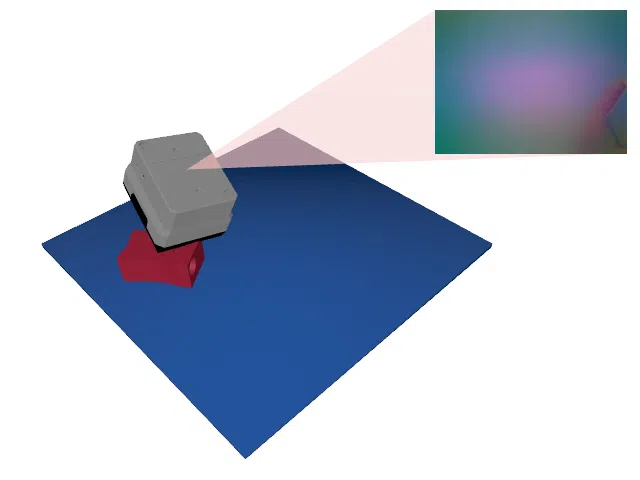             |
| ABCShape-DR-test-v0 | Same as ABCShape-test-v0 but with [domain randomization](TactilePerceptionConfig.md#sensor-noise) enabled. | 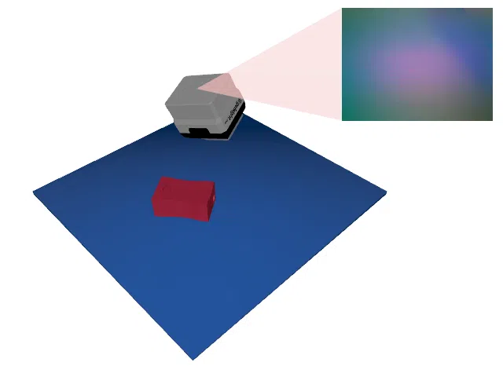 |
| ABCShape-CycleGAN-train-v0 | Uses a [CycleGAN](https://junyanz.github.io/CycleGAN/) trained on data points from the [Real Tactile MNIST](datasets.md#available-touch-datasets) dataset instead of Taxim to render the tactile images. | 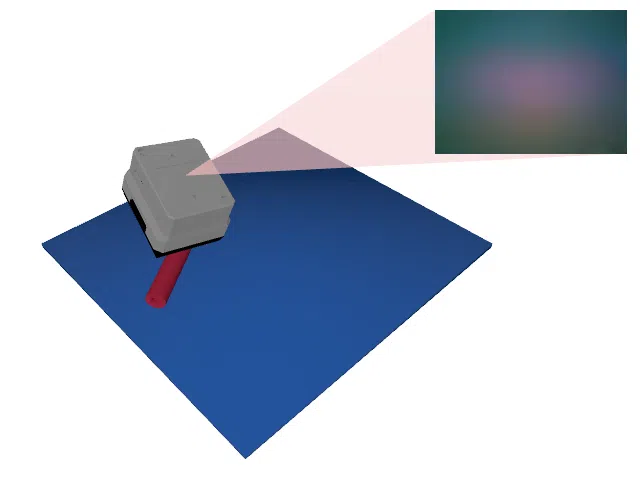 |
| ABCShape-CycleGAN-DR-v0 | Same as ABCShape-CycleGAN-v0 but with [domain randomization](TactilePerceptionConfig.md#sensor-noise) enabled. ABCShape-CycleGAN-DR-train-v0 is an alias for it. | 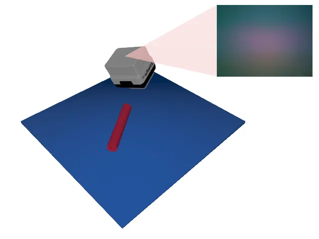 |
| ABCShape-CycleGAN-test-v0 | Same as ABCShape-CycleGAN-train-v0 but uses the test split of the _ABC Dataset_ instead of the train split. | 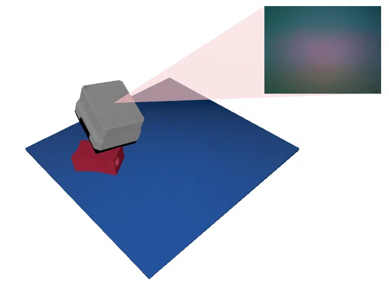 |
| ABCShape-CycleGAN-DR-test-v0 | Same as ABCShape-CycleGAN-test-v0 but with [domain randomization](TactilePerceptionConfig.md#sensor-noise) enabled. |  |
| ABCShape-Depth-train-v0 | Uses a depth image instead of rendering tactile images.                                                  | 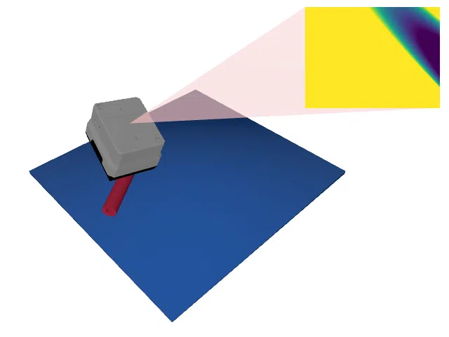           |
| ABCShape-Depth-DR-v0 | Same as ABCShape-Depth-v0 but with [domain randomization](TactilePerceptionConfig.md#sensor-noise) enabled. ABCShape-Depth-DR-train-v0 is an alias for it. | 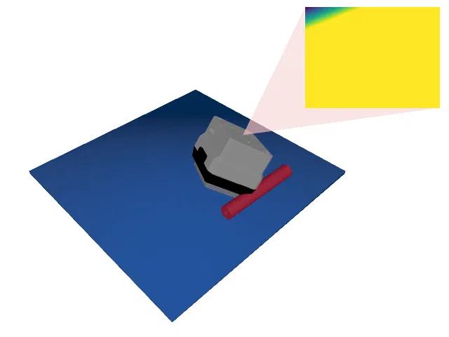 |
| ABCShape-Depth-test-v0  | Same as ABCShape-Depth-train-v0 but uses the test split of the _ABC Dataset_ instead of the train split. | 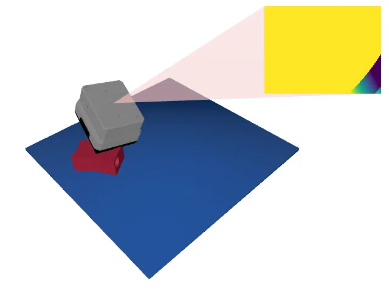 |
| ABCShape-Depth-DR-test-v0 | Same as ABCShape-Depth-test-v0 but with [domain randomization](TactilePerceptionConfig.md#sensor-noise) enabled. | 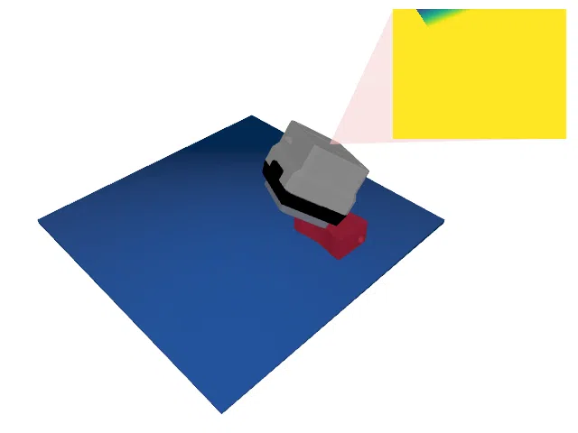 |
| ABCShapeStatic-v0 | Same as ABCShape-v0 but the object pose stays fixed while it is being touched (object pose perturbation disabled). ABCShapeStatic-train-v0 is an alias for it. | 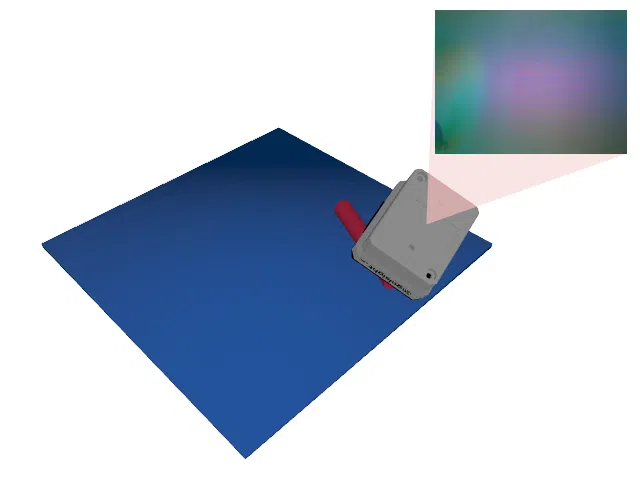 |
| ABCShapeStatic-train-v0 | Alias for ABCShapeStatic-v0. |  |
| ABCShapeStatic-DR-v0 | Same as ABCShape-DR-v0 but the object pose stays fixed while it is being touched. ABCShapeStatic-DR-train-v0 is an alias for it. |  |
| ABCShapeStatic-test-v0 | Same as ABCShape-test-v0 but the object pose stays fixed while it is being touched. | 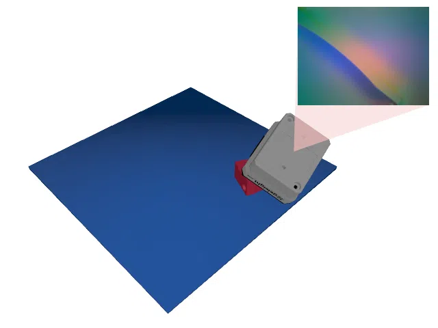 |
| ABCShapeStatic-DR-test-v0 | Same as ABCShape-DR-test-v0 but the object pose stays fixed while it is being touched. |  |
| ABCShapeStatic-CycleGAN-train-v0 | Same as ABCShape-CycleGAN-train-v0 but the object pose stays fixed while it is being touched. |  |
| ABCShapeStatic-CycleGAN-DR-v0 | Same as ABCShape-CycleGAN-DR-v0 but the object pose stays fixed while it is being touched. ABCShapeStatic-CycleGAN-DR-train-v0 is an alias for it. |  |
| ABCShapeStatic-CycleGAN-test-v0 | Same as ABCShape-CycleGAN-test-v0 but the object pose stays fixed while it is being touched. | 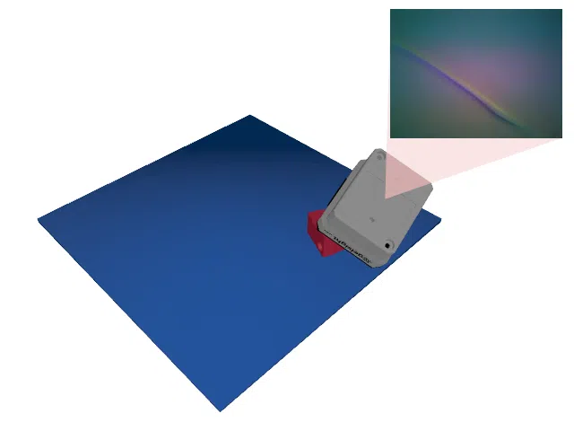 |
| ABCShapeStatic-CycleGAN-DR-test-v0 | Same as ABCShape-CycleGAN-DR-test-v0 but the object pose stays fixed while it is being touched. |  |
| ABCShapeStatic-Depth-train-v0 | Same as ABCShape-Depth-train-v0 but the object pose stays fixed while it is being touched. | 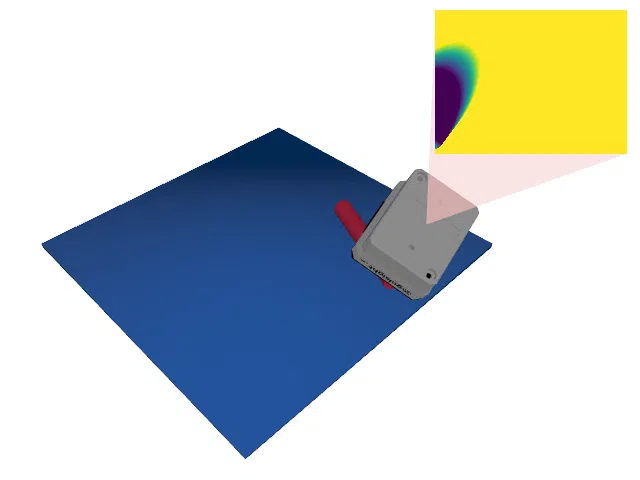 |
| ABCShapeStatic-Depth-DR-v0 | Same as ABCShape-Depth-DR-v0 but the object pose stays fixed while it is being touched. ABCShapeStatic-Depth-DR-train-v0 is an alias for it. |  |
| ABCShapeStatic-Depth-test-v0 | Same as ABCShape-Depth-test-v0 but the object pose stays fixed while it is being touched. | 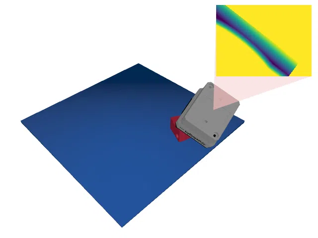 |
| ABCShapeStatic-Depth-DR-test-v0 | Same as ABCShape-Depth-DR-test-v0 but the object pose stays fixed while it is being touched. |  |
