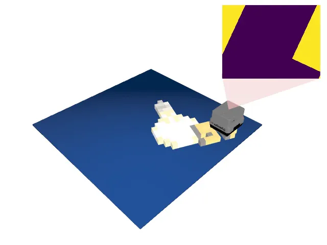

# Minecraft

<p align="center"></p>

This environment is part of the tactile classification environments.
Refer to the [tactile classification environments overview](TactileClassificationEnv.md) for a general description of these environments.

|                              |              |
|------------------------------|--------------|
| **Environment ID**           | Minecraft-v0 |
| **Number of classes**        | 301          |
| **Step limit**               | 32           |
| **Sensor rotation**          | disabled     |
| **Object pose perturbation** | enabled      |

## Description

In the Minecraft environment, the agent's objective is to classify 3D models of Minecraft items by touch alone.
The objects are generated by extruding the items' 16x16 pixel sprites into flat 3D meshes, the same way Minecraft renders dropped items.
Items that only differ in color but share the same silhouette (e.g., the wooden, stone, and iron variants of a tool) are merged into a single class, as they are indistinguishable to a tactile sensor, resulting in 301 distinct classes.
With over 30 times more classes than TactileMNIST, the main challenge in this environment is to discriminate between a large number of partially very similar silhouettes, which requires precise contour following and efficient exploration.
Object pose perturbation is enabled, meaning that the object shifts around slightly while being touched.
This requires the agent to use robust strategies that are invariant to small shifts in the object's pose.

Since the set of items is fixed, this environment has no train/test split; every instantiation uses all 301 items.

> **Note:** the Minecraft item meshes are generated on the fly from the official Minecraft game assets, which are downloaded directly from Mojang's servers on first use (~30 MB) and cached locally.
>
> NOT AN OFFICIAL MINECRAFT PRODUCT. NOT APPROVED BY OR ASSOCIATED WITH MOJANG OR MICROSOFT.

## Example Usage

```python
import ap_gym

env = ap_gym.make("Minecraft-v0")

# Or for the vectorized version with 4 environments:
envs = ap_gym.make_vec("Minecraft-v0", num_envs=4)
```

## Version History

- `v0`: Initial release.

## Variants

| Environment ID     | Description                                             | Preview                                                                             |
|--------------------|---------------------------------------------------------|-------------------------------------------------------------------------------------|
| Minecraft-Depth-v0 | Uses a depth image instead of rendering tactile images. |  |
