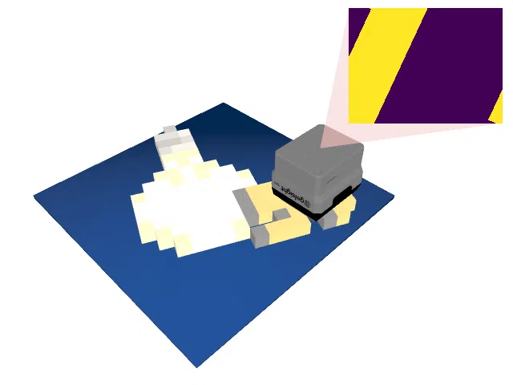

# MinecraftShape

<p align="center"></p>

This environment is part of the tactile regression environments.
Refer to the [tactile regression environments overview](TactileRegressionEnv.md) for a general description of these environments.

|                              |                   |
|------------------------------|-------------------|
| **Environment ID**           | MinecraftShape-v0 |
| **Prediction Dimensions**    | 128               |
| **Step limit**               | 32                |
| **Sensor rotation**          | disabled          |
| **Object pose perturbation** | enabled           |

## Description

In the MinecraftShape environment, the agent's objective is to reconstruct the full 3D shape of Minecraft items by touch alone.
The objects are generated by extruding the items' 16x16 pixel sprites into flat 3D meshes, the same way Minecraft renders dropped items.
The shape is represented by a compact latent embedding of a COD-VAE shape autoencoder, which the agent has to regress to.
Since every touch reveals only a small patch of the object's surface, the agent has to integrate information from many touches to reconstruct the global shape.
Compared to TactileMNISTShape, the objects in MinecraftShape exhibit a much larger variety of silhouettes, including thin protrusions and holes, which makes accurately reconstructing their geometry particularly challenging.
Object pose perturbation is enabled, meaning that the object shifts around slightly while being touched.
This requires the agent to use robust strategies that are invariant to small shifts in the object's pose.

Since the set of items is fixed, this environment has no train/test split; every instantiation uses all 301 items.

> **Note:** the Minecraft item meshes are generated on the fly from the official Minecraft game assets, which are downloaded directly from Mojang's servers on first use (~30 MB) and cached locally.
>
> NOT AN OFFICIAL MINECRAFT PRODUCT. NOT APPROVED BY OR ASSOCIATED WITH MOJANG OR MICROSOFT.

## Prediction Target Space

The prediction target is the flattened [COD-VAE](https://github.com/TimSchneider42/cod-vae) latent representation of the object's mesh (Cho et al., ICCV 2025).
The mesh, posed in the platform frame, is normalized into the COD-VAE model's $[-1, 1]$ cube and encoded into $k$ latent vectors of dimension $d$.
Flattened, this yields a $k \cdot d = 128$-element `np.ndarray` for the default model ($k = 4$, $d = 32$).
Since the cube normalization removes the object's position and scale, the target jointly encodes the object's shape and its current (randomized and perturbed) orientation on the platform.
Unlike a factored orientation-plus-shape representation, this joint representation remains well-defined even for (rotationally) symmetric objects, for which the orientation alone would be ambiguous.
The latent is a deterministic function of the posed mesh: encoding uses the deterministic posterior mean, the surface sampling is seeded, and the latent tokens are put into a canonical order.
A mesh can be reconstructed from a predicted latent by decoding it into an occupancy field with the same COD-VAE model (see `cod_vae.CODVAEBase.decode_mesh`).
If the `renderer_show_shadow_objects` option is enabled, the environment decodes the agent's current prediction every step and renders it as a translucent shadow object; this is disabled by default, as it requires a COD-VAE decoder pass per step.

COD-VAE latents are KL-regularized towards a standard normal, so they are approximately unit scale and are regressed without further normalization.

The COD-VAE model can be changed via the `model` argument, which accepts a Hugging Face Hub repository id or a local npz checkpoint:

```python
import ap_gym

env = ap_gym.make("MinecraftShape-v0", model="TimSchneider42/cod-vae-4x32")
```

## Metrics

On top of the standard regression metrics, this environment logs the following metrics in the `info` dictionary:

- `latent_rmse`: the RMS error between the predicted and the target latent.
- `rel_error`: the Euclidean norm of the latent error relative to the norm of the target latent.

## Example Usage

```python
import ap_gym

env = ap_gym.make("MinecraftShape-v0")

# Or for the vectorized version with 4 environments:
envs = ap_gym.make_vec("MinecraftShape-v0", num_envs=4)
```

## Version History

- `v0`: Initial release.

## Variants

| Environment ID          | Description                                             | Preview                                                                                       |
|-------------------------|---------------------------------------------------------|-----------------------------------------------------------------------------------------------|
| MinecraftShape-Depth-v0 | Uses a depth image instead of rendering tactile images. |  |
