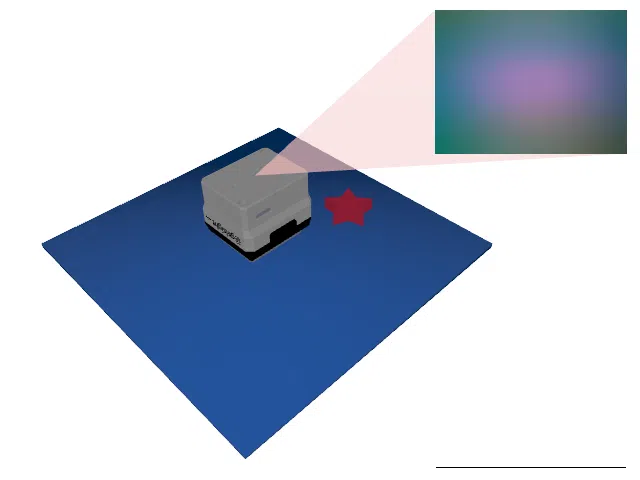
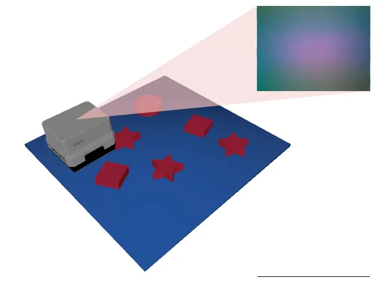
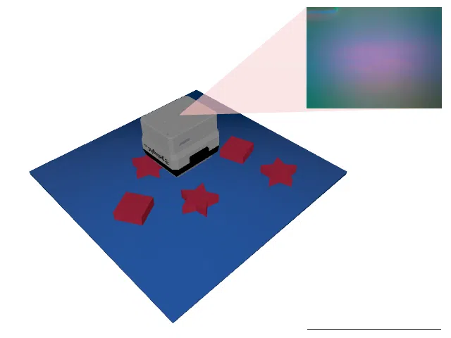
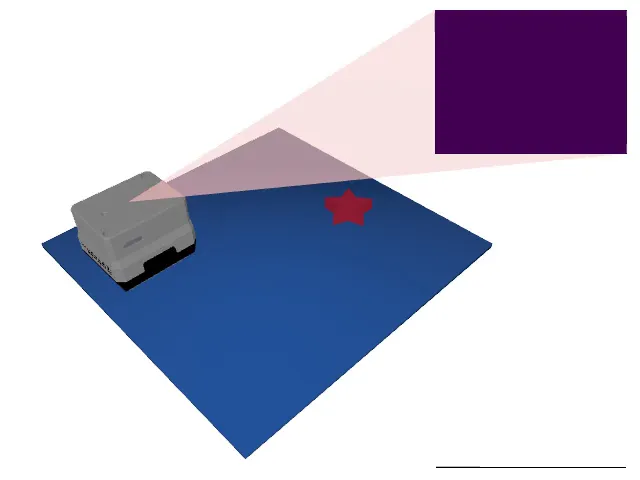
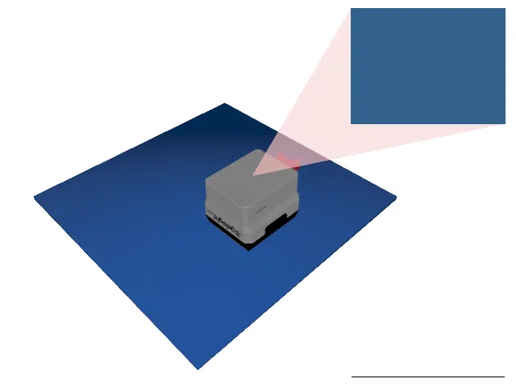
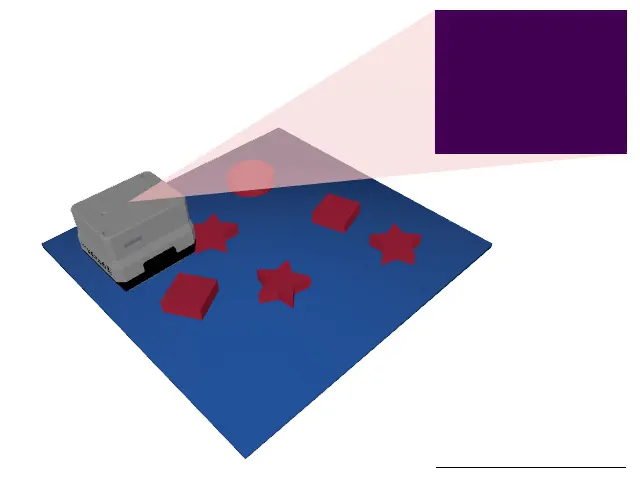
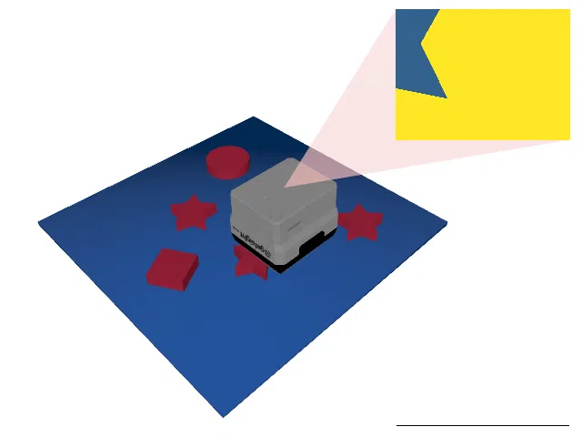

# Starstruck

<p align="center"></p>

This environment is part of the tactile classification environments.
Refer to the [tactile classification environments overview](TactileClassificationEnv.md) for a general description of these environments.

|                              |                                                               |
|------------------------------|---------------------------------------------------------------|
| **Environment ID**           | Starstruck-v0                                                 |
| **Dataset**                  | [Starstruck](datasets.md#starstruck) (procedurally generated) |
| **Number of classes**        | 3                                                             |
| **Step limit**               | 32                                                            |
| **Sensor rotation**          | disabled                                                      |
| **Object pose perturbation** | disabled                                                      |

## Description

In the _Starstruck_ environment, the agent must count the number of stars in a scene cluttered with other objects.
Since all stars look the same, distinguishing stars from other objects is rather straightforward.
Instead, the main challenge posed in this environment is to learn an effective search strategy to systematically cover as much space as possible.

The scenes are not stored anywhere but generated procedurally on the fly: each of the 300,000 scenes of the train split and the 300,000 scenes of the test split is derived deterministically from its index with a stable pseudo random number generator (see the [dataset description](datasets.md#starstruck)).
Hence, the agent cannot simply memorize the object arrangements and has to learn a search strategy that generalizes.

## Example Usage

```python
import ap_gym

env = ap_gym.make("Starstruck-v0")

# Or for the vectorized version with 4 environments:
envs = ap_gym.make_vec("Starstruck-v0", num_envs=4)
```

## Version History

- `v0`: Initial release. Initially shipped with a [static version](https://huggingface.co/datasets/TimSchneider42/tactile-mnist-starstruck) of the dataset (3,300 pre-computed scenes), which was replaced by the procedurally generated [Starstruck](datasets.md#starstruck) dataset.

## Variants

| Environment ID            | Description                                                                                         | Preview                                                                                        |
|---------------------------|-----------------------------------------------------------------------------------------------------|------------------------------------------------------------------------------------------------|
| Starstruck-train-v0       | Alias for Starstruck-v0.                                                                            |                        |
| Starstruck-DR-v0 | Same as Starstruck-v0 but with [domain randomization](TactilePerceptionConfig.md#sensor-noise) enabled. Starstruck-DR-train-v0 is an alias for it. |  |
| Starstruck-test-v0        | Uses the test split of _Starstruck_ instead of the train split.                                     |              |
| Starstruck-DR-test-v0 | Same as Starstruck-test-v0 but with [domain randomization](TactilePerceptionConfig.md#sensor-noise) enabled. |  |
| Starstruck-Depth-train-v0 | Uses a depth image instead of rendering tactile images.                                             |            |
| Starstruck-Depth-DR-v0 | Same as Starstruck-Depth-v0 but with [domain randomization](TactilePerceptionConfig.md#sensor-noise) enabled. Starstruck-Depth-DR-train-v0 is an alias for it. |  |
| Starstruck-Depth-test-v0  | Same as Starstruck-Depth-train-v0 but uses the test split of _Starstruck_ instead of the train split. |  |
| Starstruck-Depth-DR-test-v0 | Same as Starstruck-Depth-test-v0 but with [domain randomization](TactilePerceptionConfig.md#sensor-noise) enabled. |  |
