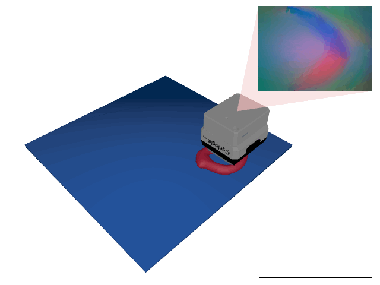
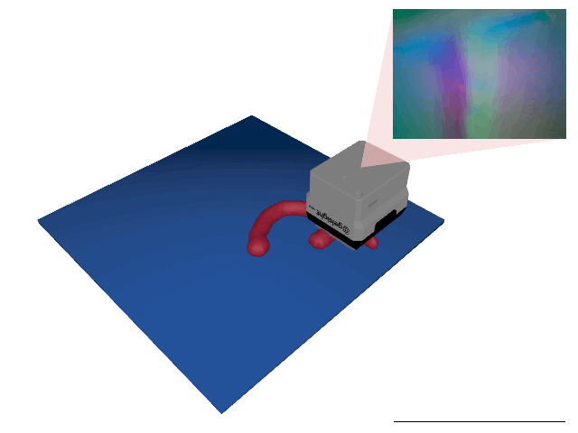
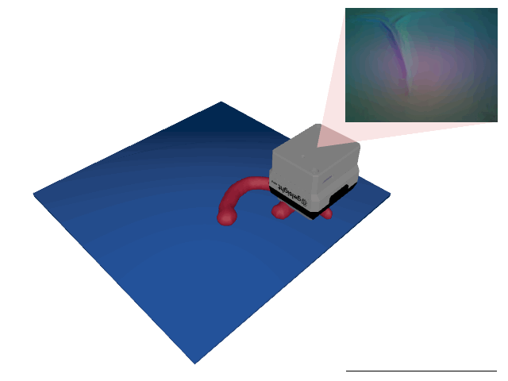

# TactileMNIST

<p align="center"></p>

This environment is part of the tactile classification environments.
Refer to the [tactile classification environments overview](TactileClassificationEnv.md) for a general description of these environments.

|                              |                                    |
|------------------------------|------------------------------------|
| **Environment ID**           | TactileMNIST-v0                    |
| **Dataset**                  | [MNIST 3D](datasets.md#mnist-3d) |
| **Number of classes**        | 10                                 |
| **Step limit**               | 16                                 |
| **Sensor rotation**          | disabled                           |
| **Object pose perturbation** | enabled                            |

## Description

In the TactileMNIST environment, the agent's objective is to classify 3D models of handwritten digits by touch alone.
Aside from finding the object, the main challenge in the TactileMNIST environment is to learn contour following strategies to efficiently classify it once found.
Object pose perturbation is enabled, meaning that the object shifts around slightly while being touched.
This requires the agent to use robust strategies that are invariant to small shifts in the object's pose.

## Example Usage

```python
import ap_gym

env = ap_gym.make("TactileMNIST-v0")

# Or for the vectorized version with 4 environments:
envs = ap_gym.make_vec("TactileMNIST-v0", num_envs=4)
```

## Version History

- `v0`: Initial release.

## Variants

| Environment ID                 | Description                                                                                                                                                                             | Preview                                                                                                  |
|--------------------------------|-----------------------------------------------------------------------------------------------------------------------------------------------------------------------------------------|----------------------------------------------------------------------------------------------------------|
| TactileMNIST-train-v0          | Alias for TactileMNIST-v0.                                                                                                                                                              |                              |
| TactileMNIST-test-v0           | Uses the test split of _MNIST 3D_ instead of the train split.                                                                                                                           |                    |
| TactileMNIST-CycleGAN-train-v0 | Uses a [CycleGAN](https://junyanz.github.io/CycleGAN/) trained on data points from the [Real Tactile MNIST](#real-tactile-mnist) dataset instead of Taxim to render the tactile images. |            |
| TactileMNIST-CycleGAN-test-v0  | Same as TactileMNIST-CycleGAN-train-v0 but uses the test split of _MNIST 3D_ instead of the train split.                                                                                |  |
| TactileMNIST-Depth-train-v0    | Uses a depth image instead of rendering tactile images.                                                                                                                                 |                  |
| TactileMNIST-Depth-test-v0     | Same as TactileMNIST-Depth-train-v0 but uses the test split of _MNIST 3D_ instead of the train split.                                                                                   |        |
