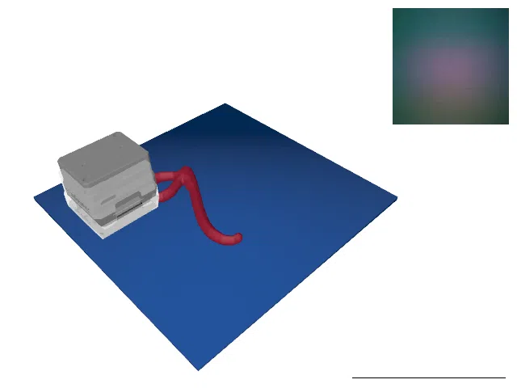
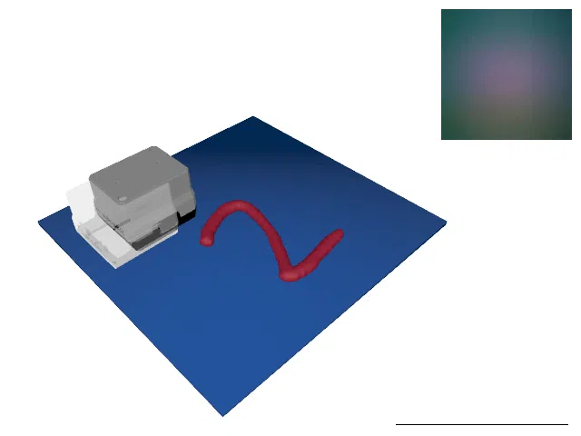

# TactileMNISTRealSnap

<p align="center"></p>

This environment is part of the tactile classification environments.
Refer to the [tactile classification environments overview](TactileClassificationEnv.md) for a general description of these environments.

|                       |                                                                                              |
|-----------------------|----------------------------------------------------------------------------------------------|
| **Environment ID**    | TactileMNISTRealSnap-v0                                                                    |
| **Dataset**           | [Real Tactile MNIST](datasets.md#available-touch-datasets) (`touch-real-single-t256-64x64`)  |
| **Number of classes** | 10                                                                                           |
| **Step limit**        | 16                                                                                           |
| **Sensor rotation**   | disabled                                                                                     |

## Description

In the TactileMNISTRealSnap environment, the agent's objective is to classify 3D models of handwritten digits by touch alone, just as in the [TactileMNIST](TactileMNIST.md) environment.
However, instead of simulating tactile images, this environment replays real touch data collected with a GelSight Mini sensor on 3D printed digits.

Since the prerecorded touch positions were sampled uniformly at random over the cell, the agent cannot position the sensor freely.
Instead, in every step, the environment considers a window of the next 32 prerecorded touches of the current round and selects the touch whose position is closest to the position the agent requested.
The selection always moves forward in the recorded data: if touch $i$ was selected in one step, the next step selects among touches $i + 1, \dots, i + 32$.
On reset, the first touch is selected among the first 32 touches of the round, closest to a randomly sampled initial target position.
Once no full window of 32 touches remains after the current touch, the episode is truncated.

The same touch selection scheme can be simulated in the synthetic TactileMNIST environments by setting the `snap_touch_positions` option of the [TactilePerceptionConfig](TactilePerceptionConfig.md) (see, e.g., the Snap variants of [TactileMNIST](TactileMNIST.md)).
A volume estimation environment based on the same touch selection scheme is available as [TactileMNISTVolumeRealSnap](TactileMNISTVolumeRealSnap.md).

## Rendering

If a mesh dataset is provided via the `mesh_dataset` config option (enabled by default, using the `printed_train`/`printed_test` splits of [MNIST 3D](datasets.md#mnist-3d)), `env.render()` shows the object mesh of the current round together with the effective sensor pose of the selected touch (solid sensor), the requested target sensor position (transparent sensor), and the real tactile image of the current touch.
Note that the object is displayed in a default position (centered in the cell, resting on the platform), as the actual pose of the object during data collection is not known.
Rendering can be disabled by passing `config=dict(mesh_dataset=None)`, in which case `env.render()` returns the raw tactile images.

## Configuration

The environment is configured with the `TactileRealSnapConfig` class, which contains the following settings:

| Parameter                       | Type                                             | Default            | Description                                                                                                                                                                                                               |
|---------------------------------|--------------------------------------------------|--------------------|---------------------------------------------------------------------------------------------------------------------------------------------------------------------------------------------------------------------------|
| `dataset`                       | `TouchSingleDataset \| Sequence[TouchSingleDataset]` |                | The dataset(s) containing prerecorded touches. If a single dataset is provided, it is duplicated for all environments.                                                                                                    |
| `touch_window_size`             | `int`                                            | `32`               | Size of the window of upcoming prerecorded touches the next touch is selected from. The episode is truncated once no full window of touches remains.                                                                      |
| `step_limit`                    | `int`                                            | `16`               | The maximum number of steps per episode.                                                                                                                                                                                  |
| `sensor_output_size`            | `Sequence[int] \| None`                          | `None`             | The output size of the sensor images in pixels. Defaults to the native resolution of the dataset if not provided.                                                                                                         |
| `randomize_initial_sensor_pose` | `bool`                                           | `True`             | Whether to randomize the initial sensor target position.                                                                                                                                                                  |
| `linear_velocity`               | `float`                                          | `0.2`              | Maximum linear velocity of the sensor (in m/s).                                                                                                                                                                           |
| `linear_acceleration`           | `float`                                          | `4.0`              | Maximum linear acceleration of the sensor (in m/s²).                                                                                                                                                                      |
| `transfer_timedelta_s`          | `float`                                          | `0.2`              | The time step between two steps.                                                                                                                                                                                          |
| `action_regularization`         | `float`                                          | `1e-3`             | Regularization coefficient for actions.                                                                                                                                                                                   |
| `timeout_behavior`              | `Literal["terminate", "truncate"]`               | `"terminate"`      | Whether to set the terminate or truncate flag when a timeout occurs. Note, that this flag has influence on the observation space, as the `time_step` observation will only be included when this is set to `"terminate"`. |
| `cell_size`                     | `tuple[float, float]`                            | `(0.12, 0.12)`     | Size of the platform in m.                                                                                                                                                                                                |
| `cell_padding`                  | `tuple[float, float]`                            | `(0.0215, 0.0195)` | Padding of the platform in m. The sensor may not enter the padding area of the platform.                                                                                                                                  |
| `mesh_dataset`                  | `MeshDataset \| Sequence[MeshDataset] \| None`   | `None`             | Mesh dataset containing the models of the touched objects. The mesh of each round is looked up by matching the round's `object_id` against the mesh datapoint ids. Required for regression tasks (e.g. [TactileMNISTVolumeRealSnap](TactileMNISTVolumeRealSnap.md)) and otherwise used for visualization only. If `None`, `env.render()` returns the raw tactile images. |
| `enable_rendering`              | `bool`                                           | `True`             | Whether to build the scene renderer if a mesh dataset is provided. Disable to run mesh-based tasks without a display/EGL context.                                                                                          |
| `show_sensor_target_pos`        | `bool`                                           | `True`             | Whether to show the requested target sensor position as a transparent sensor in the rendering.                                                                                                                            |
| `renderer_show_tactile_image`   | `bool`                                           | `True`             | Whether to show the real tactile image of the current touch in the image produced by the `env.render()` function.                                                                                                         |
| `renderer_show_class_weights`   | `bool`                                           | `False`            | Whether to show the class weights in the image produced by the `env.render()` function (if applicable).                                                                                                                   |
| `render_transparent_background` | `bool`                                           | `False`            | Whether to render the background transparent.                                                                                                                                                                             |
| `renderer_external_camera_resolution` | `tuple[int, int]`                          | `(640, 480)`       | The resolution of the image produced by the `env.render()` function.                                                                                                                                                      |

## Example Usage

```python
import ap_gym

env = ap_gym.make("TactileMNISTRealSnap-v0")

# Or for the vectorized version with 4 environments:
envs = ap_gym.make_vec("TactileMNISTRealSnap-v0", num_envs=4)
```

## Version History

- `v0`: Initial release.

## Variants

| Environment ID | Description | Preview |
|----------------|-------------|---------|
| TactileMNISTRealSnap-train-v0 | Alias for TactileMNISTRealSnap-v0. |  |
| TactileMNISTRealSnap-test-v0 | Uses the test split of _Real Tactile MNIST_ instead of the train split. |  |
