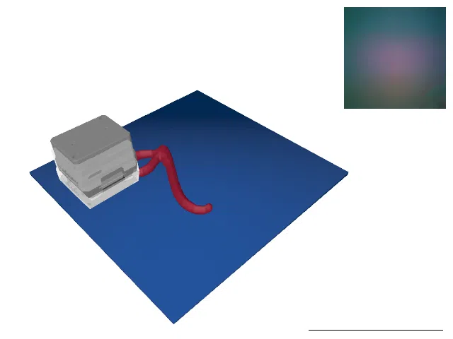
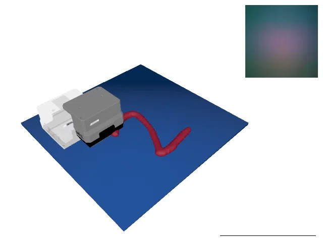
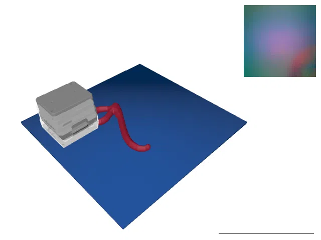
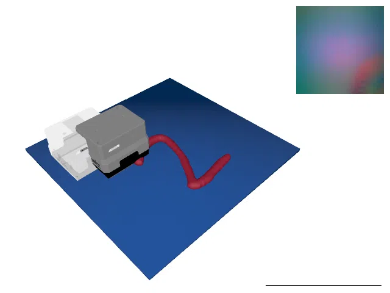
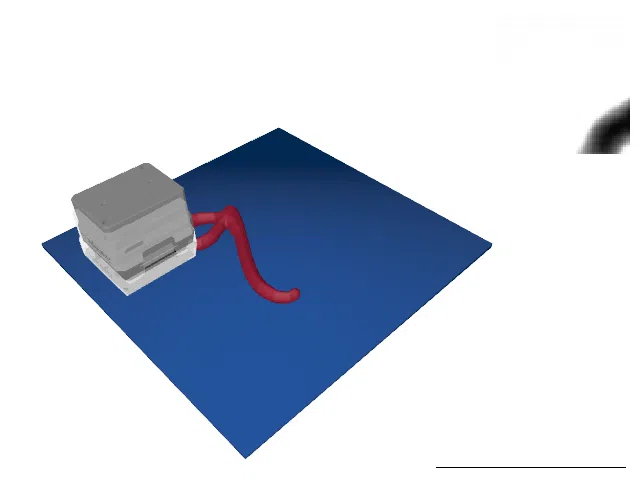
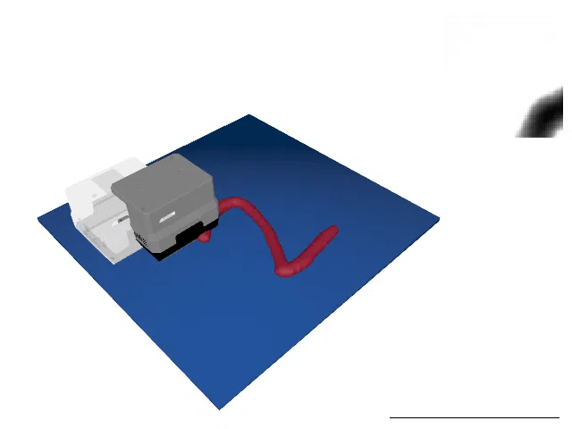

# TactileMNISTRealSnap

<p align="center"></p>

This environment is part of the tactile classification environments.
Refer to the [tactile classification environments overview](TactileClassificationEnv.md) for a general description of these environments.

|                       |                                                                                              |
|-----------------------|----------------------------------------------------------------------------------------------|
| **Environment ID**    | TactileMNISTRealSnap-v0                                                                    |
| **Dataset**           | [Real Tactile MNIST](datasets.md#available-touch-datasets) (`touch-real-single-t256-320x240`)  |
| **Number of classes** | 10                                                                                           |
| **Step limit**        | 16                                                                                           |
| **Sensor rotation**   | disabled                                                                                     |

## Description

In the TactileMNISTRealSnap environment, the agent's objective is to classify 3D models of handwritten digits by touch alone, just as in the [TactileMNIST](TactileMNIST.md) environment.
However, instead of simulating tactile images, this environment replays real touch data collected with a GelSight Mini sensor on 3D printed digits.

Since the prerecorded touch positions were sampled uniformly at random over the cell, the agent cannot position the sensor freely.
Instead, in every step, the environment considers a window of the next $w$ prerecorded touches of the current round and selects the touch whose position is closest to the position the agent requested.
The selection always moves forward in the recorded data: if touch $i$ was selected in one step, the next step selects among touches $i + 1, \dots, i + w$.
On reset, the first touch is selected among the first $w$ touches of the round, closest to a randomly sampled initial target position.
Once no full window of $w$ touches remains after the current touch, the episode is truncated.
The window size $w$ is not set directly, but derived from the `approx_truncation_probability` config option: it is chosen as large as possible while keeping the probability of such an early truncation approximately at that value.
With the default settings (256 prerecorded touches per round, a step limit of 16, and a truncation probability of 0.1), the window contains 23 touches.

The same touch selection scheme can be simulated in the synthetic TactileMNIST environments by setting the `snap_touch_positions` option of the [TactilePerceptionConfig](TactilePerceptionConfig.md) (see, e.g., the Snap variants of [TactileMNIST](TactileMNIST.md)).
A volume estimation environment based on the same touch selection scheme is available as [TactileMNISTVolumeRealSnap](TactileMNISTVolumeRealSnap.md).

## Sensor Z-Position

The zero of the recorded gel z-positions drifts between rounds by up to 3mm, as it depends on the state of the gel and the calibration of the robot at the time of recording.
Without a correction, the z-component of the `sensor_pos` observation is therefore offset by an unknown per-round constant and does not match the simulated environments, where z is measured from the platform surface.
Since every round contains touches that miss the object and press down on the platform, the deepest touch of a round marks the platform surface.
With `recalibrate_sensor_z` enabled (the default), the environment therefore determines the minimum z-position over all touches of the round before the episode starts and shifts the recorded z-positions such that this minimum corresponds to `GEL_PENETRATION_DEPTH_MM` above the platform, which is the sensor z-position the simulated environments report when the sensor touches the platform.

## Re-Rendering the Recorded Images

By default, this environment returns the recorded tactile images as they are, which makes its observations differ visibly from the ones the simulated environments produce.
Setting the `sensor_type` config option to anything other than its default `"direct"` enables a translation into the simulated domain: a depth map is estimated from every recorded tactile image with a `DepthEstimator`, and that depth map is then rendered with the same `TactileRenderer` the simulated environments use.
The renderer is selected exactly as in the simulated environments, via `sensor_type`, `sensor_backend`, `sensor_device`, and `sensor_device_index`.

The depth estimator is the inverse generator of the same CycleGAN whose forward generator drives the `cycle_gan` renderer, so `sensor_type="cycle_gan"` sends each image through both directions of that CycleGAN and yields images in the domain of, e.g., [TactileMNISTSnap-CycleGAN-v0](TactileMNIST.md).
Setting `sensor_type="taxim"` or `sensor_type="depth"` instead renders the estimated depth map with Taxim or returns it directly, matching the corresponding simulated variants.

Preregistered variants are listed under [Variants](#variants).

## Rendering

If a mesh dataset is provided via the `mesh_dataset` config option (enabled by default, using the `printed_train`/`printed_test` splits of [MNIST 3D](datasets.md#mnist-3d)), `env.render()` shows the object mesh of the current round together with the effective sensor pose of the selected touch (solid sensor), the requested target sensor position (transparent sensor), and the real tactile image of the current touch.
Note that the object is displayed in a default position (centered in the cell, resting on the platform), as the actual pose of the object during data collection is not known.
Rendering can be disabled by passing `config=dict(mesh_dataset=None)`, in which case `env.render()` returns the raw tactile images.

## Configuration

The environment is configured with the `TactileRealSnapConfig` class, which contains the following settings:

| Parameter                       | Type                                             | Default            | Description                                                                                                                                                                                                               |
|---------------------------------|--------------------------------------------------|--------------------|---------------------------------------------------------------------------------------------------------------------------------------------------------------------------------------------------------------------------|
| `dataset`                       | `TouchSingleDataset \| Sequence[TouchSingleDataset]` |                | The dataset(s) containing prerecorded touches. If a single dataset is provided, it is duplicated for all environments.                                                                                                    |
| `approx_truncation_probability`  | `float`                                          | `0.1`              | Target probability of an episode being truncated early because the prerecorded touches of the round ran out. The window size is chosen accordingly (see above). The actual probability is slightly higher, as the model behind this computation neglects that the touch selection favors later touches.                              |
| `step_limit`                    | `int`                                            | `16`               | The maximum number of steps per episode.                                                                                                                                                                                  |
| `sensor_output_size`            | `Sequence[int] \| None`                          | `None`             | The output size of the sensor images in pixels. Defaults to the native resolution of the dataset if not provided.                                                                                                         |
| `randomize_initial_sensor_pose` | `bool`                                           | `True`             | Whether to randomize the initial sensor target position.                                                                                                                                                                  |
| `linear_velocity`               | `float`                                          | `0.2`              | Maximum linear velocity of the sensor (in m/s).                                                                                                                                                                           |
| `linear_acceleration`           | `float`                                          | `4.0`              | Maximum linear acceleration of the sensor (in m/s²).                                                                                                                                                                      |
| `transfer_timedelta_s`          | `float`                                          | `0.2`              | The time step between two steps.                                                                                                                                                                                          |
| `action_regularization`         | `float`                                          | `1e-3`             | Regularization coefficient for actions.                                                                                                                                                                                   |
| `timeout_behavior`              | `Literal["terminate", "truncate"]`               | `"terminate"`      | Whether to set the terminate or truncate flag when a timeout occurs. Note, that this flag has influence on the observation space, as the `time_step` observation will only be included when this is set to `"terminate"`. |
| `cell_size`                     | `tuple[float, float]`                            | `(0.12, 0.12)`     | Size of the platform in m.                                                                                                                                                                                                |
| `cell_padding`                  | `tuple[float, float]`                            | `(0.0215, 0.0195)` | Padding of the platform in m. The sensor may not enter the padding area of the platform.                                                                                                                                  |
| `mesh_dataset`                  | `MeshDataset \| Sequence[MeshDataset] \| None`   | `None`             | Mesh dataset containing the models of the touched objects. The mesh of each round is looked up by matching the round's `object_id` against the mesh datapoint ids. Required for regression tasks (e.g. [TactileMNISTVolumeRealSnap](TactileMNISTVolumeRealSnap.md)) and otherwise used for visualization only. If `None`, `env.render()` returns the raw tactile images. |
| `recalibrate_sensor_z`          | `bool`                                           | `True`             | Whether to re-zero the recorded gel z-positions of each round on its deepest touch (see [Sensor Z-Position](#sensor-z-position)). Disable to observe the raw recorded z-positions.                                                                             |
| `sensor_type`                   | `Literal["direct", "taxim", "depth", "cycle_gan"]` | `"direct"`         | With `"direct"`, the recorded tactile images are returned as they are. With any other value, Instead, a depth map is estimated from every image and re-rendered with the given renderer, which maps the recordings into the domain of the corresponding simulated environment (see [Re-Rendering the Recorded Images](#re-rendering-the-recorded-images)). |
| `sensor_backend`                | `Literal["torch", "jax", "numpy", "auto"]`       | `"auto"`           | The backend used for re-rendering. Only used if `sensor_type` is not `"direct"`.                                                                                                                                                                                       |
| `sensor_device`                 | `str \| None`                                    | `None`             | The device used for re-rendering. Only used if `sensor_type` is not `"direct"`.                                                                                                                                                                                        |
| `sensor_device_index`           | `int`                                            | `0`                | The index of the device used for re-rendering. Only used if `sensor_type` is not `"direct"`.                                                                                                                                                                           |
| `depth_estimator_type`          | `Literal["cycle_gan"]`                           | `"cycle_gan"`      | The depth estimator used to recover a depth map from each recorded tactile image. Only used if `sensor_type` is not `"direct"`.                                                                                                                                        |
| `depth_estimator_backend`       | `Literal["torch", "jax", "auto"] \| None`        | `None`             | The backend used for depth estimation. Defaults to `sensor_backend`, except that it falls back to `"auto"` if `sensor_backend` is `"numpy"`, for which no depth estimator exists.                                                                            |
| `enable_rendering`              | `bool`                                           | `True`             | Whether to build the scene renderer if a mesh dataset is provided. Disable to run mesh-based tasks without a display/EGL context.                                                                                          |
| `show_sensor_target_pos`        | `bool`                                           | `True`             | Whether to show the requested target sensor position as a transparent sensor in the rendering.                                                                                                                            |
| `renderer_show_tactile_image`   | `bool`                                           | `True`             | Whether to show the real tactile image of the current touch in the image produced by the `env.render()` function.                                                                                                         |
| `renderer_show_class_weights`   | `bool`                                           | `False`            | Whether to show the class weights in the image produced by the `env.render()` function (if applicable).                                                                                                                   |
| `render_transparent_background` | `bool`                                           | `False`            | Whether to render the background transparent.                                                                                                                                                                             |
| `renderer_external_camera_resolution` | `tuple[int, int]`                          | `(640, 480)`       | The resolution of the image produced by the `env.render()` function.                                                                                                                                                      |

## Example Usage

```python
import ap_gym

env = ap_gym.make("TactileMNISTRealSnap-v0")

# Or for the vectorized version with 4 environments:
envs = ap_gym.make_vec("TactileMNISTRealSnap-v0", num_envs=4)
```

## Version History

- `v0`: Initial release.

## Variants

| Environment ID | Description | Preview |
|----------------|-------------|---------|
| TactileMNISTRealSnap-train-v0 | Alias for TactileMNISTRealSnap-v0. |  |
| TactileMNISTRealSnap-test-v0 | Uses the test split of _Real Tactile MNIST_ instead of the train split. |  |
| TactileMNISTRealSnap-CycleGAN-v0 | Re-renders the recorded tactile images with the [CycleGAN](https://junyanz.github.io/CycleGAN/) renderer, mapping them into the domain of [TactileMNISTSnap-CycleGAN-v0](TactileMNIST.md) (see [Re-Rendering the Recorded Images](#re-rendering-the-recorded-images)). TactileMNISTRealSnap-CycleGAN-train-v0 is an alias for it. |  |
| TactileMNISTRealSnap-CycleGAN-test-v0 | Same as TactileMNISTRealSnap-CycleGAN-v0 but uses the test split of _Real Tactile MNIST_. |  |
| TactileMNISTRealSnap-Taxim-v0 | Same as TactileMNISTRealSnap-CycleGAN-v0 but renders the estimated depth maps with [Taxim](https://arxiv.org/abs/2109.04027), mapping them into the domain of [TactileMNISTSnap-v0](TactileMNIST.md). TactileMNISTRealSnap-Taxim-train-v0 is an alias for it. |  |
| TactileMNISTRealSnap-Taxim-test-v0 | Same as TactileMNISTRealSnap-Taxim-v0 but uses the test split of _Real Tactile MNIST_. |  |
| TactileMNISTRealSnap-Depth-v0 | Same as TactileMNISTRealSnap-CycleGAN-v0 but observes the estimated depth maps directly, matching [TactileMNISTSnap-Depth-v0](TactileMNIST.md). TactileMNISTRealSnap-Depth-train-v0 is an alias for it. |  |
| TactileMNISTRealSnap-Depth-test-v0 | Same as TactileMNISTRealSnap-Depth-v0 but uses the test split of _Real Tactile MNIST_. |  |
