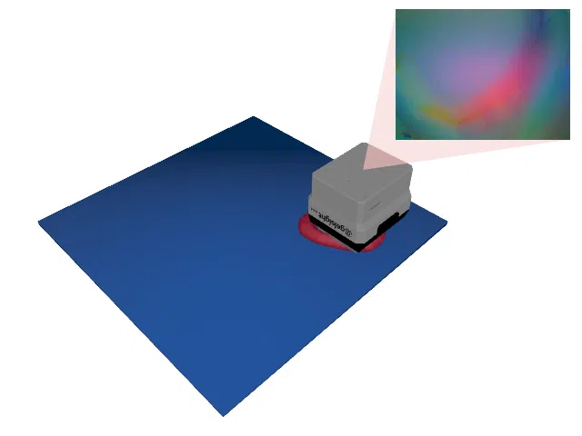
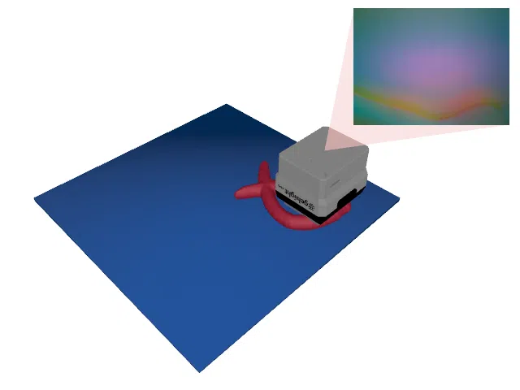
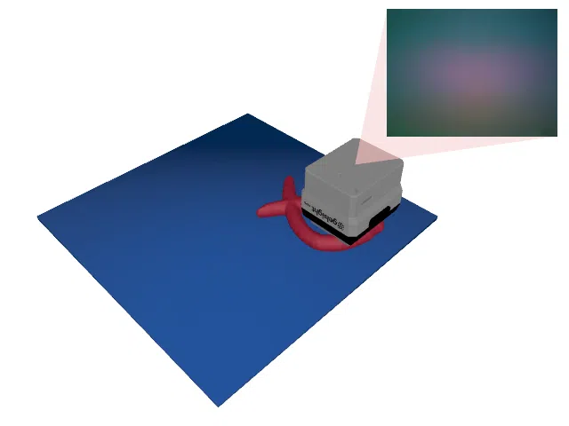
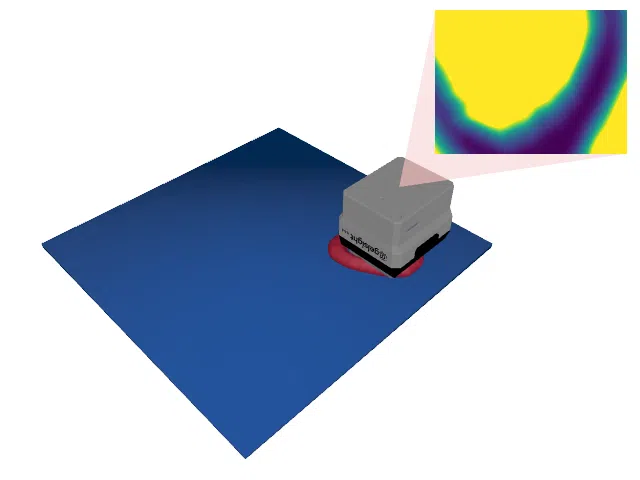
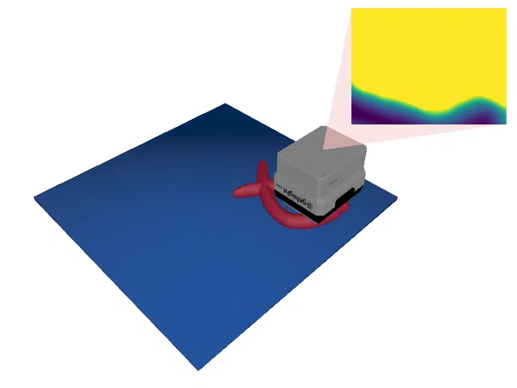

# TactileMNISTShape

<p align="center"></p>

This environment is part of the tactile regression environments.
Refer to the [tactile regression environments overview](TactileRegressionEnv.md) for a general description of these environments.

|                              |                                  |
|------------------------------|----------------------------------|
| **Environment ID**           | TactileMNISTShape-v0             |
| **Dataset**                  | [MNIST 3D](datasets.md#mnist-3d) |
| **Prediction Dimensions**    | 192                              |
| **Step limit**               | 32                               |
| **Sensor rotation**          | disabled                         |
| **Object pose perturbation** | enabled                          |

## Description

In the TactileMNISTShape environment, the agent's objective is to reconstruct the full 3D shape of 3D models of handwritten digits by touch alone.
The shape is represented by a truncated spectral (Laplacian) representation of the object's mesh, which the agent has to regress to.
Since every touch reveals only a small patch of the object's surface, the agent has to integrate information from many touches to reconstruct the global shape.
Object pose perturbation is enabled, meaning that the object shifts around slightly while being touched.
This requires the agent to use robust strategies that are invariant to small shifts in the object's pose.

## Prediction Target Space

The prediction target is the truncated Laplace-Beltrami spectral representation of the object's mesh.
For each object, we compute the cotangent Laplace-Beltrami operator of its mesh and take the eigenvectors $\Phi \in \mathbb{R}^{n \times k}$ corresponding to the $k = 64$ smallest eigenvalues, where $n$ is the number of vertices of the mesh.
The prediction target are the spectral coefficients of the vertex positions $V \in \mathbb{R}^{n \times 3}$:

$$C = \Phi^T M V \in \mathbb{R}^{k \times 3}$$

where $M$ is the lumped (barycentric) mass matrix of the mesh.
Flattened, this yields a $3k = 192$-element `np.ndarray`.
Intuitively, $C$ is a frequency decomposition of the object's geometry: the low-order coefficients encode the object's position and coarse shape, while higher-order coefficients encode finer geometric detail.
A smoothed version of the object can be reconstructed from a prediction $\hat{C}$ via $\hat{V} = \Phi \hat{C}$, which the environment uses to render the agent's current prediction as a translucent shadow object.

The vertex positions $V$ are expressed in the platform frame, meaning that the prediction target jointly encodes the object's shape and its current (randomized and perturbed) pose on the platform.
Hence, the agent has to simultaneously infer where the object is and what shape it has.
Unlike a factored pose-plus-shape representation, this joint representation remains well-defined even for (rotationally) symmetric objects, for which the pose alone would be ambiguous.
The sign of each eigenvector is fixed deterministically, making the target a well-defined function of the object and its pose.

The targets are normalized per dimension to have a mean of 0 and a standard deviation of 1 across the training set under random object poses.
Note that when running the environment for the first time, computing these normalization statistics from the training dataset might take some time, as it requires a sparse eigendecomposition for every mesh in the dataset.
However, this is only done once and the values are cached for future runs.

The number of spectral coefficients can be changed via the `num_coefficients` argument:

```python
import ap_gym

env = ap_gym.make("TactileMNISTShape-v0", num_coefficients=32)
```

## Metrics

On top of the standard regression metrics, this environment logs the following metrics in the `info` dictionary:

- `reconstruction_error_mm`: the mass-weighted RMS error between the predicted and the target reconstruction of the object's surface in millimeters.
- `rel_error`: the reconstruction error relative to the object's RMS radius.

Since the prediction target jointly encodes shape and pose, the environment additionally decomposes the reconstruction error into a position, a rotation, and a residual shape component:

- `position_error_mm`: the distance between the centroids of the predicted and the target reconstruction in millimeters.
- `rotation_error`: the angle (in radians) of the Z-rotation that optimally aligns the centered predicted reconstruction with the centered target reconstruction (2D orthogonal Procrustes).
- `shape_error_mm`: the mass-weighted RMS error remaining after removing the position and rotation components, i.e. the pure shape error, in millimeters.

## Example Usage

```python
import ap_gym

env = ap_gym.make("TactileMNISTShape-v0")

# Or for the vectorized version with 4 environments:
envs = ap_gym.make_vec("TactileMNISTShape-v0", num_envs=4)
```

## Version History

- `v0`: Initial release.

## Variants

| Environment ID                      | Description                                                                                                                                                                            | Preview                                                                                                            |
|-------------------------------------|----------------------------------------------------------------------------------------------------------------------------------------------------------------------------------------|--------------------------------------------------------------------------------------------------------------------|
| TactileMNISTShape-train-v0          | Alias for TactileMNISTShape-v0.                                                                                                                                                        |                              |
| TactileMNISTShape-test-v0           | Uses the test split of _MNIST 3D_ instead of the train split.                                                                                                                          |                    |
| TactileMNISTShape-CycleGAN-train-v0 | Uses a [CycleGAN](https://junyanz.github.io/CycleGAN/) trained on data points from the [Real Tactile MNIST](datasets.md#available-touch-datasets) dataset instead of Taxim to render the tactile images. |            |
| TactileMNISTShape-CycleGAN-test-v0  | Same as TactileMNISTShape-CycleGAN-train-v0 but uses the test split of _MNIST 3D_ instead of the train split.                                                                          |  |
| TactileMNISTShape-Depth-train-v0    | Uses a depth image instead of rendering tactile images.                                                                                                                                |                  |
| TactileMNISTShape-Depth-test-v0     | Same as TactileMNISTShape-Depth-train-v0 but uses the test split of _MNIST 3D_ instead of the train split.                                                                             |        |
