# TactileMNISTShape

<p align="center"></p>

This environment is part of the tactile shape reconstruction environments.
Refer to the [tactile shape reconstruction environments overview](TactileShapeReconstructionEnv.md) for a general description of these environments, including their prediction space, prediction target, loss, and metrics.

|                              |                                  |
|------------------------------|----------------------------------|
| **Environment ID**           | TactileMNISTShape-v0             |
| **Dataset**                  | [MNIST 3D](datasets.md#mnist-3d) |
| **Prediction Dimensions**    | 132                              |
| **Step limit**               | 16                               |
| **Sensor rotation**          | disabled                         |
| **Object pose perturbation** | enabled                          |

## Description

In the TactileMNISTShape environment, the agent's objective is to reconstruct the full 3D shape of 3D models of handwritten digits by touch alone.
Object pose perturbation is enabled, meaning that the object shifts around slightly while being touched.
This requires the agent to use robust strategies that are invariant to small shifts in the object's pose.
The TactileMNISTShapeStatic variants disable this perturbation, so the object stays fixed in place for the entire episode, though its initial pose is still randomized.

## Example Usage

```python
import ap_gym

env = ap_gym.make("TactileMNISTShape-v0")

# Or for the vectorized version with 4 environments:
envs = ap_gym.make_vec("TactileMNISTShape-v0", num_envs=4)
```

## Version History

- `v0`: Initial release.

## Variants

| Environment ID                      | Description                                                                                                                                                                            | Preview                                                                                                            |
|-------------------------------------|----------------------------------------------------------------------------------------------------------------------------------------------------------------------------------------|--------------------------------------------------------------------------------------------------------------------|
| TactileMNISTShape-train-v0          | Alias for TactileMNISTShape-v0.                                                                                                                                                        |                              |
| TactileMNISTShape-DR-v0 | Same as TactileMNISTShape-v0 but with [domain randomization](TactilePerceptionConfig.md#sensor-noise) enabled. TactileMNISTShape-DR-train-v0 is an alias for it. | 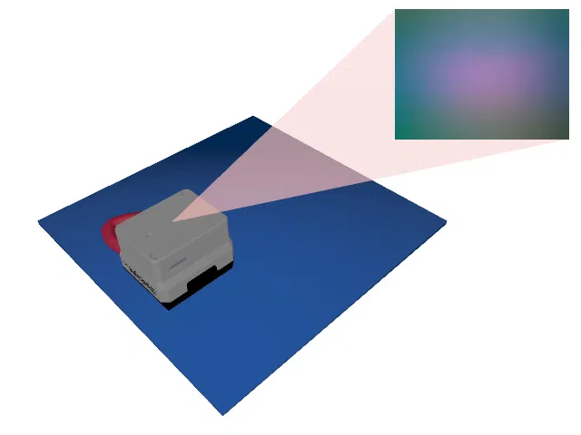 |
| TactileMNISTShape-test-v0           | Uses the test split of _MNIST 3D_ instead of the train split.                                                                                                                          |                    |
| TactileMNISTShape-DR-test-v0 | Same as TactileMNISTShape-test-v0 but with [domain randomization](TactilePerceptionConfig.md#sensor-noise) enabled. |  |
| TactileMNISTShape-CycleGAN-train-v0 | Uses a [CycleGAN](https://junyanz.github.io/CycleGAN/) trained on data points from the [Real Tactile MNIST](datasets.md#available-touch-datasets) dataset instead of Taxim to render the tactile images. |            |
| TactileMNISTShape-CycleGAN-DR-v0 | Same as TactileMNISTShape-CycleGAN-v0 but with [domain randomization](TactilePerceptionConfig.md#sensor-noise) enabled. TactileMNISTShape-CycleGAN-DR-train-v0 is an alias for it. | 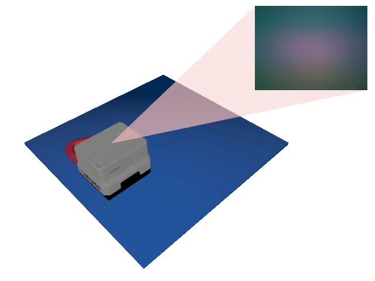 |
| TactileMNISTShape-CycleGAN-test-v0  | Same as TactileMNISTShape-CycleGAN-train-v0 but uses the test split of _MNIST 3D_ instead of the train split.                                                                          |  |
| TactileMNISTShape-CycleGAN-DR-test-v0 | Same as TactileMNISTShape-CycleGAN-test-v0 but with [domain randomization](TactilePerceptionConfig.md#sensor-noise) enabled. | 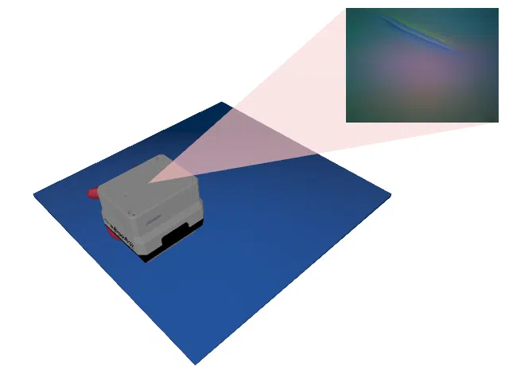 |
| TactileMNISTShape-Depth-train-v0    | Uses a depth image instead of rendering tactile images.                                                                                                                                |                  |
| TactileMNISTShape-Depth-DR-v0 | Same as TactileMNISTShape-Depth-v0 but with [domain randomization](TactilePerceptionConfig.md#sensor-noise) enabled. TactileMNISTShape-Depth-DR-train-v0 is an alias for it. | 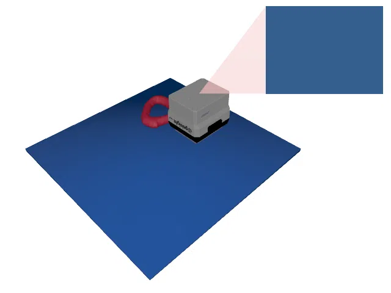 |
| TactileMNISTShape-Depth-test-v0     | Same as TactileMNISTShape-Depth-train-v0 but uses the test split of _MNIST 3D_ instead of the train split.                                                                             |        |
| TactileMNISTShape-Depth-DR-test-v0 | Same as TactileMNISTShape-Depth-test-v0 but with [domain randomization](TactilePerceptionConfig.md#sensor-noise) enabled. |  |
| TactileMNISTShapeSnap-train-v0 | Snap variant of TactileMNISTShape-v0: instead of positioning the sensor freely, in every step, 23 touch positions are sampled uniformly over the cell and the one closest to the requested target position is chosen. This simulates the touch selection scheme of the [TactileMNISTRealSnap](TactileMNISTRealSnap.md) environment. | 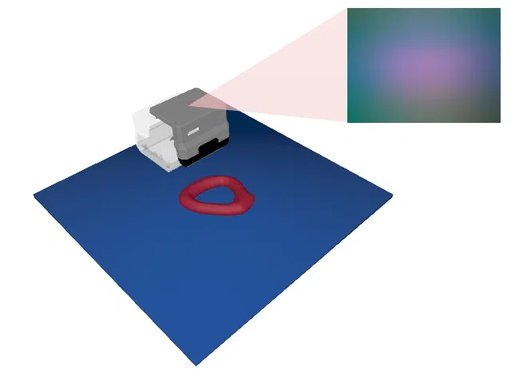 |
| TactileMNISTShapeSnap-DR-v0 | Same as TactileMNISTShapeSnap-v0 but with [domain randomization](TactilePerceptionConfig.md#sensor-noise) enabled. TactileMNISTShapeSnap-DR-train-v0 is an alias for it. | 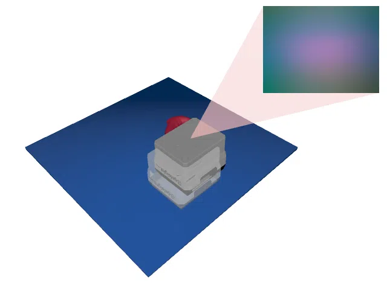 |
| TactileMNISTShapeSnap-test-v0 | Same as TactileMNISTShapeSnap-train-v0 but uses the test split of _MNIST 3D_ instead of the train split. | 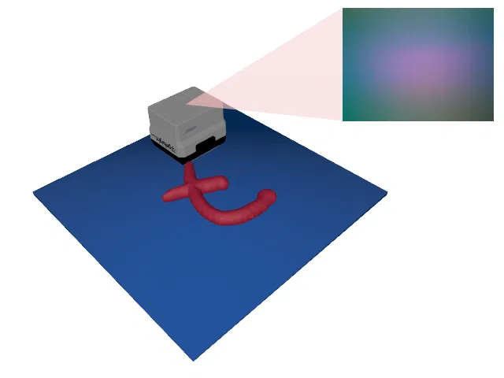 |
| TactileMNISTShapeSnap-DR-test-v0 | Same as TactileMNISTShapeSnap-test-v0 but with [domain randomization](TactilePerceptionConfig.md#sensor-noise) enabled. | 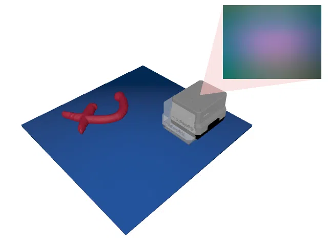 |
| TactileMNISTShapeSnap-CycleGAN-train-v0 | Same as TactileMNISTShapeSnap-train-v0 but uses a [CycleGAN](https://junyanz.github.io/CycleGAN/) trained on data points from the [Real Tactile MNIST](datasets.md#available-touch-datasets) dataset instead of Taxim to render the tactile images. | 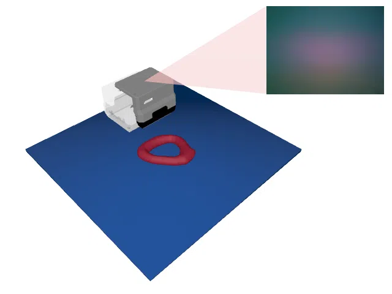 |
| TactileMNISTShapeSnap-CycleGAN-DR-v0 | Same as TactileMNISTShapeSnap-CycleGAN-v0 but with [domain randomization](TactilePerceptionConfig.md#sensor-noise) enabled. TactileMNISTShapeSnap-CycleGAN-DR-train-v0 is an alias for it. | 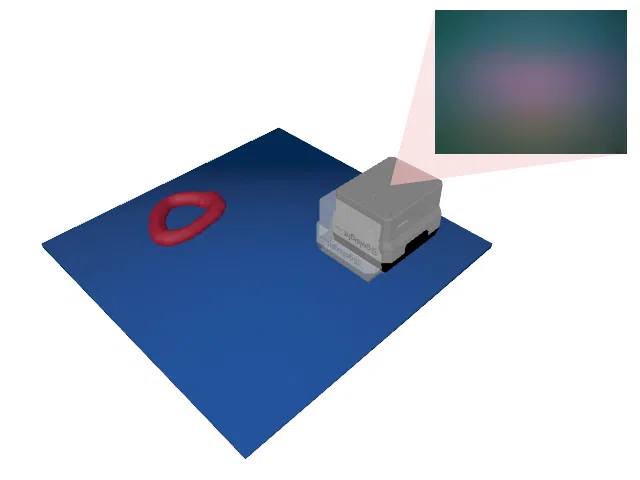 |
| TactileMNISTShapeSnap-CycleGAN-test-v0 | Same as TactileMNISTShapeSnap-CycleGAN-train-v0 but uses the test split of _MNIST 3D_ instead of the train split. | 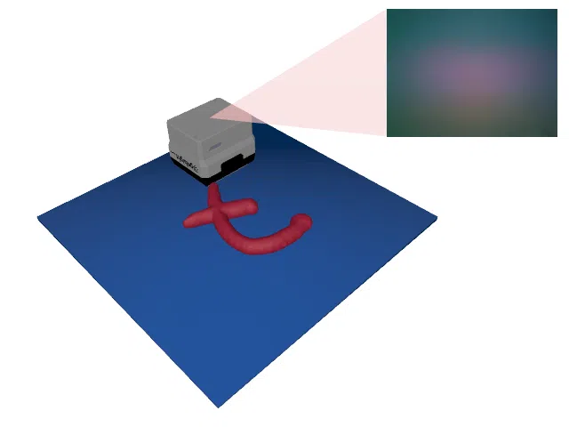 |
| TactileMNISTShapeSnap-CycleGAN-DR-test-v0 | Same as TactileMNISTShapeSnap-CycleGAN-test-v0 but with [domain randomization](TactilePerceptionConfig.md#sensor-noise) enabled. |  |
| TactileMNISTShapeSnap-Depth-train-v0 | Same as TactileMNISTShapeSnap-train-v0 but uses a depth image instead of rendering tactile images. | 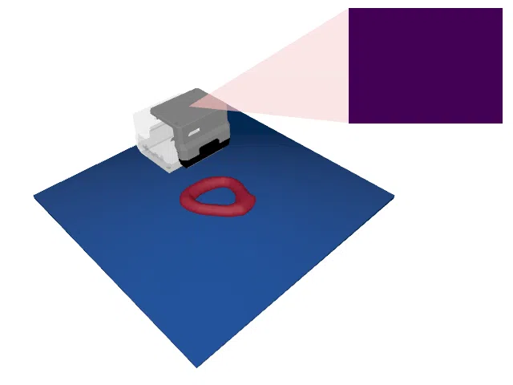 |
| TactileMNISTShapeSnap-Depth-DR-v0 | Same as TactileMNISTShapeSnap-Depth-v0 but with [domain randomization](TactilePerceptionConfig.md#sensor-noise) enabled. TactileMNISTShapeSnap-Depth-DR-train-v0 is an alias for it. | 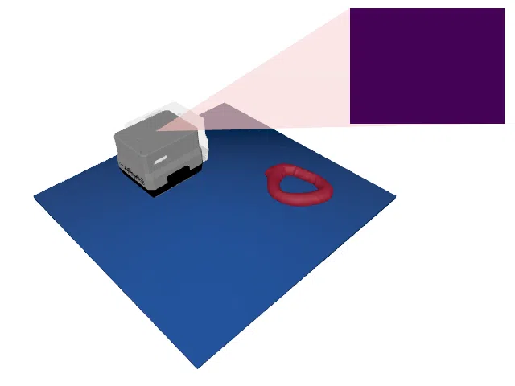 |
| TactileMNISTShapeSnap-Depth-test-v0 | Same as TactileMNISTShapeSnap-Depth-train-v0 but uses the test split of _MNIST 3D_ instead of the train split. | 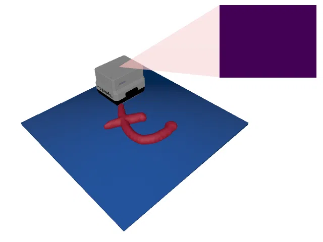 |
| TactileMNISTShapeSnap-Depth-DR-test-v0 | Same as TactileMNISTShapeSnap-Depth-test-v0 but with [domain randomization](TactilePerceptionConfig.md#sensor-noise) enabled. | 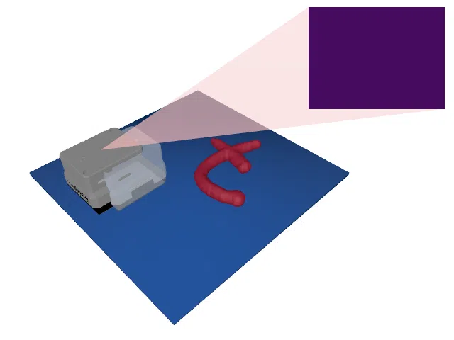 |
| TactileMNISTShapeStatic-v0 | Same as TactileMNISTShape-v0 but the object pose stays fixed while it is being touched (object pose perturbation disabled). TactileMNISTShapeStatic-train-v0 is an alias for it. |  |
| TactileMNISTShapeStatic-train-v0 | Alias for TactileMNISTShapeStatic-v0. |  |
| TactileMNISTShapeStatic-DR-v0 | Same as TactileMNISTShape-DR-v0 but the object pose stays fixed while it is being touched. TactileMNISTShapeStatic-DR-train-v0 is an alias for it. | 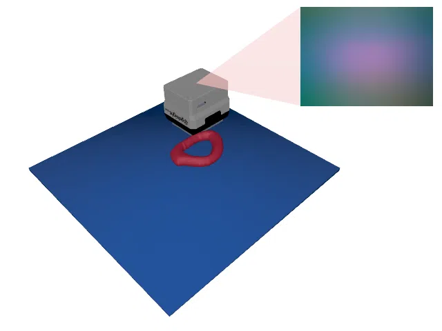 |
| TactileMNISTShapeStatic-test-v0 | Same as TactileMNISTShape-test-v0 but the object pose stays fixed while it is being touched. |  |
| TactileMNISTShapeStatic-DR-test-v0 | Same as TactileMNISTShape-DR-test-v0 but the object pose stays fixed while it is being touched. |  |
| TactileMNISTShapeStatic-CycleGAN-train-v0 | Same as TactileMNISTShape-CycleGAN-train-v0 but the object pose stays fixed while it is being touched. |  |
| TactileMNISTShapeStatic-CycleGAN-DR-v0 | Same as TactileMNISTShape-CycleGAN-DR-v0 but the object pose stays fixed while it is being touched. TactileMNISTShapeStatic-CycleGAN-DR-train-v0 is an alias for it. | 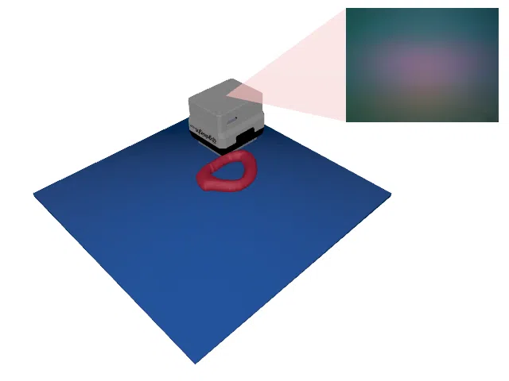 |
| TactileMNISTShapeStatic-CycleGAN-test-v0 | Same as TactileMNISTShape-CycleGAN-test-v0 but the object pose stays fixed while it is being touched. | 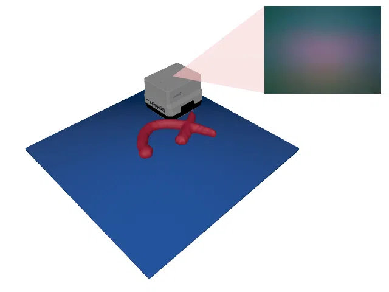 |
| TactileMNISTShapeStatic-CycleGAN-DR-test-v0 | Same as TactileMNISTShape-CycleGAN-DR-test-v0 but the object pose stays fixed while it is being touched. |  |
| TactileMNISTShapeStatic-Depth-train-v0 | Same as TactileMNISTShape-Depth-train-v0 but the object pose stays fixed while it is being touched. |  |
| TactileMNISTShapeStatic-Depth-DR-v0 | Same as TactileMNISTShape-Depth-DR-v0 but the object pose stays fixed while it is being touched. TactileMNISTShapeStatic-Depth-DR-train-v0 is an alias for it. |  |
| TactileMNISTShapeStatic-Depth-test-v0 | Same as TactileMNISTShape-Depth-test-v0 but the object pose stays fixed while it is being touched. | 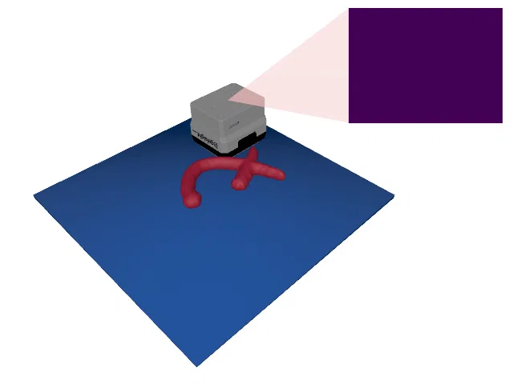 |
| TactileMNISTShapeStatic-Depth-DR-test-v0 | Same as TactileMNISTShape-Depth-DR-test-v0 but the object pose stays fixed while it is being touched. | 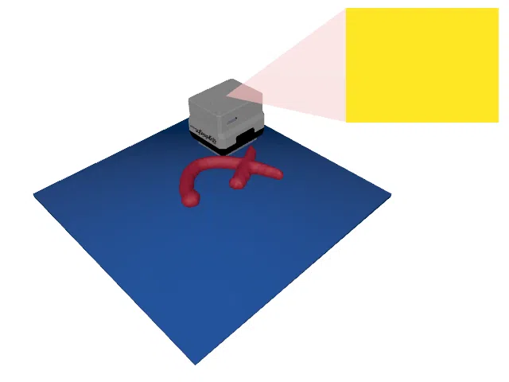 |
| TactileMNISTShapeStaticSnap-train-v0 | Same as TactileMNISTShapeSnap-train-v0 but the object pose stays fixed while it is being touched. |  |
| TactileMNISTShapeStaticSnap-DR-v0 | Same as TactileMNISTShapeSnap-DR-v0 but the object pose stays fixed while it is being touched. TactileMNISTShapeStaticSnap-DR-train-v0 is an alias for it. |  |
| TactileMNISTShapeStaticSnap-test-v0 | Same as TactileMNISTShapeSnap-test-v0 but the object pose stays fixed while it is being touched. | 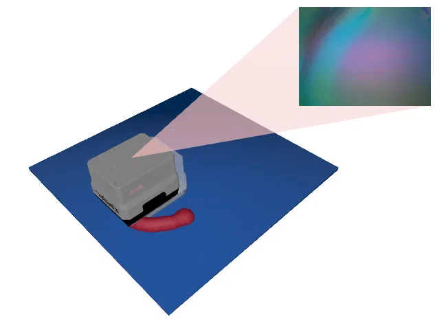 |
| TactileMNISTShapeStaticSnap-DR-test-v0 | Same as TactileMNISTShapeSnap-DR-test-v0 but the object pose stays fixed while it is being touched. |  |
| TactileMNISTShapeStaticSnap-CycleGAN-train-v0 | Same as TactileMNISTShapeSnap-CycleGAN-train-v0 but the object pose stays fixed while it is being touched. |  |
| TactileMNISTShapeStaticSnap-CycleGAN-DR-v0 | Same as TactileMNISTShapeSnap-CycleGAN-DR-v0 but the object pose stays fixed while it is being touched. TactileMNISTShapeStaticSnap-CycleGAN-DR-train-v0 is an alias for it. |  |
| TactileMNISTShapeStaticSnap-CycleGAN-test-v0 | Same as TactileMNISTShapeSnap-CycleGAN-test-v0 but the object pose stays fixed while it is being touched. |  |
| TactileMNISTShapeStaticSnap-CycleGAN-DR-test-v0 | Same as TactileMNISTShapeSnap-CycleGAN-DR-test-v0 but the object pose stays fixed while it is being touched. |  |
| TactileMNISTShapeStaticSnap-Depth-train-v0 | Same as TactileMNISTShapeSnap-Depth-train-v0 but the object pose stays fixed while it is being touched. | 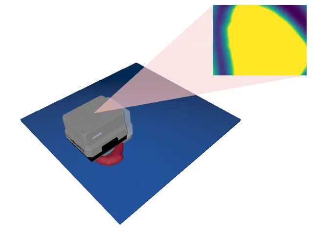 |
| TactileMNISTShapeStaticSnap-Depth-DR-v0 | Same as TactileMNISTShapeSnap-Depth-DR-v0 but the object pose stays fixed while it is being touched. TactileMNISTShapeStaticSnap-Depth-DR-train-v0 is an alias for it. |  |
| TactileMNISTShapeStaticSnap-Depth-test-v0 | Same as TactileMNISTShapeSnap-Depth-test-v0 but the object pose stays fixed while it is being touched. | 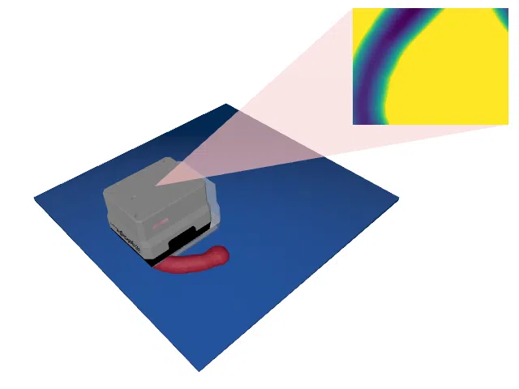 |
| TactileMNISTShapeStaticSnap-Depth-DR-test-v0 | Same as TactileMNISTShapeSnap-Depth-DR-test-v0 but the object pose stays fixed while it is being touched. |  |
