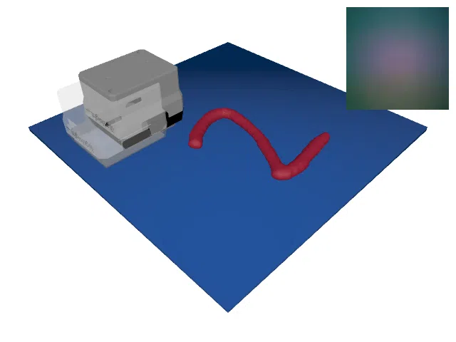
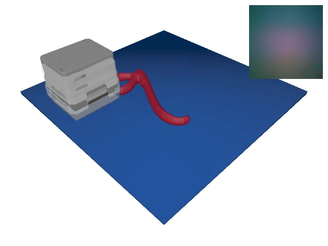
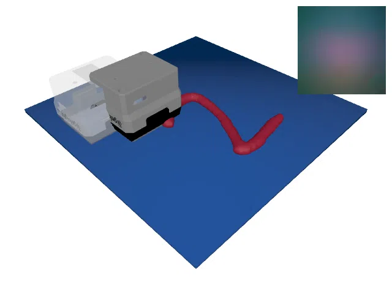
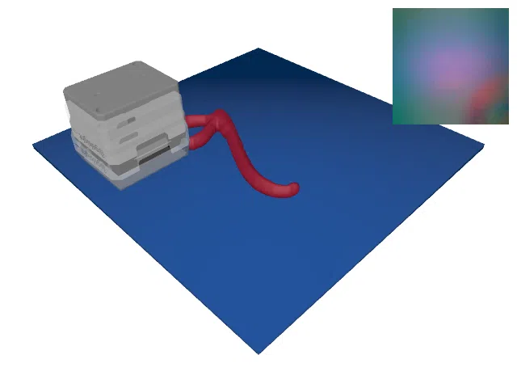
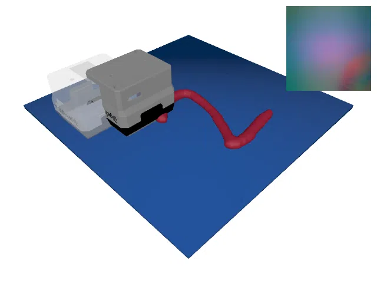
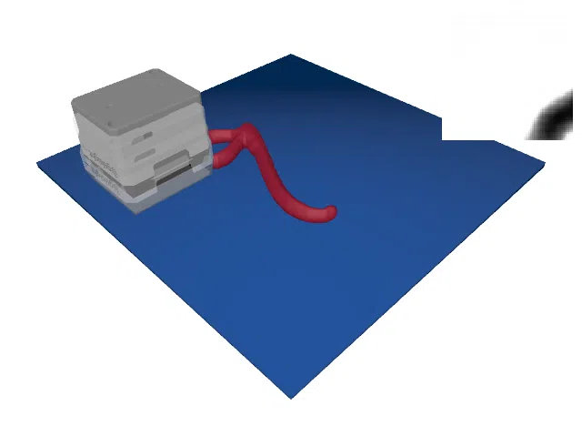
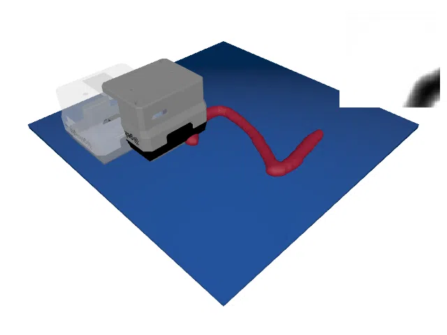

# TactileMNISTVolumeRealSnap

<p align="center"></p>

This environment is part of the tactile regression environments.
Refer to the [tactile regression environments overview](TactileRegressionEnv.md) for a general description of these environments.

|                       |                                                                                              |
|-----------------------|----------------------------------------------------------------------------------------------|
| **Environment ID**    | TactileMNISTVolumeRealSnap-v0                                                              |
| **Dataset**           | [Real Tactile MNIST](datasets.md#available-touch-datasets) (`touch-real-single-t256-320x240`)  |
| **N**                 | 1                                                                                            |
| **Step limit**        | 16                                                                                           |
| **Sensor rotation**   | disabled                                                                                     |

## Description

In the TactileMNISTVolumeRealSnap environment, the agent's objective is to estimate the volume of 3D printed handwritten digits by touch alone, just as in the [TactileMNISTVolume](TactileMNISTVolume.md) environment.
However, instead of simulating tactile images, this environment replays real touch data collected with a GelSight Mini sensor, using the same touch selection scheme as the [TactileMNISTRealSnap](TactileMNISTRealSnap.md) environment:
in every step, the environment considers a window of the next prerecorded touches of the current round and selects the touch whose position is closest to the position the agent requested.
The selection always moves forward in the recorded data, and once no full window of touches remains, the episode is truncated.
Refer to the [TactileMNISTRealSnap](TactileMNISTRealSnap.md) documentation for a detailed description of the touch selection scheme, the `TactileRealSnapConfig` class, and the rendering.

The prediction target is the volume of the touched object, normalized by the statistics of the mesh dataset.
The object volumes are computed from the `printed_train`/`printed_test` splits of [MNIST 3D](datasets.md#mnist-3d), which contain the models of the 3D printed digits used to collect the real touch data.
Consequently, unlike in TactileMNISTRealSnap, the `mesh_dataset` config option is required in this environment.

## Example Usage

```python
import ap_gym

env = ap_gym.make("TactileMNISTVolumeRealSnap-v0")

# Or for the vectorized version with 4 environments:
envs = ap_gym.make_vec("TactileMNISTVolumeRealSnap-v0", num_envs=4)
```

## Version History

- `v0`: Initial release.

## Variants

| Environment ID | Description | Preview |
|----------------|-------------|---------|
| TactileMNISTVolumeRealSnap-train-v0 | Alias for TactileMNISTVolumeRealSnap-v0. |  |
| TactileMNISTVolumeRealSnap-test-v0 | Uses the test split of _Real Tactile MNIST_ instead of the train split. |  |
| TactileMNISTVolumeRealSnap-CycleGAN-v0 | Re-renders the recorded tactile images with the [CycleGAN](https://junyanz.github.io/CycleGAN/) renderer, mapping them into the domain of [TactileMNISTVolumeSnap-CycleGAN-v0](TactileMNISTVolume.md) (see [Re-Rendering the Recorded Images](TactileMNISTRealSnap.md#re-rendering-the-recorded-images)). TactileMNISTVolumeRealSnap-CycleGAN-train-v0 is an alias for it. |  |
| TactileMNISTVolumeRealSnap-CycleGAN-test-v0 | Same as TactileMNISTVolumeRealSnap-CycleGAN-v0 but uses the test split of _Real Tactile MNIST_. |  |
| TactileMNISTVolumeRealSnap-Taxim-v0 | Same as TactileMNISTVolumeRealSnap-CycleGAN-v0 but renders the estimated depth maps with [Taxim](https://arxiv.org/abs/2109.04027), mapping them into the domain of [TactileMNISTVolumeSnap-v0](TactileMNISTVolume.md). TactileMNISTVolumeRealSnap-Taxim-train-v0 is an alias for it. |  |
| TactileMNISTVolumeRealSnap-Taxim-test-v0 | Same as TactileMNISTVolumeRealSnap-Taxim-v0 but uses the test split of _Real Tactile MNIST_. |  |
| TactileMNISTVolumeRealSnap-Depth-v0 | Same as TactileMNISTVolumeRealSnap-CycleGAN-v0 but observes the estimated depth maps directly, matching [TactileMNISTVolumeSnap-Depth-v0](TactileMNISTVolume.md). TactileMNISTVolumeRealSnap-Depth-train-v0 is an alias for it. |  |
| TactileMNISTVolumeRealSnap-Depth-test-v0 | Same as TactileMNISTVolumeRealSnap-Depth-v0 but uses the test split of _Real Tactile MNIST_. |  |
