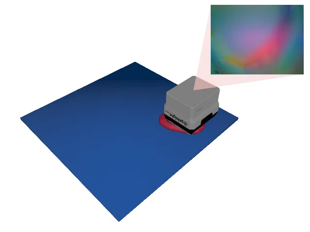
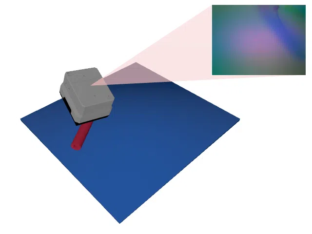
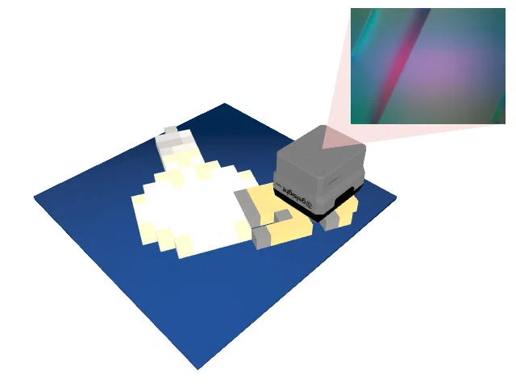

# Tactile Regression Environments

In tactile regression environments, the agent has to infer a continuous property from a 3D object by exploring it with a [GelSight Mini](https://www.gelsight.com/gelsightmini/) tactile sensor.
The agent does not have access to the object's location or orientation and also receives no visual input.
Instead, it must actively control the sensor to find and explore the object.

For more details on tactile perception environments in general, see the [Tactile Perception Environments documentation](TactilePerceptionEnv.md).

Currently implemented are the following tasks, which are described in more detail in their respective documentations:

    <table style="border-collapse: collapse; border: none;">
        <tr style="border: none;">
            <td align="center" style="border: none; padding: 10px;">
                 
                <a href="Toolbox.md">
                    Toolbox-v0
                </a>
            </td>
            <td align="center" style="border: none; padding: 10px;">
                 
                <a href="TactileMNISTCenterOfMass.md">
                    TactileMNISTCenterOfMass-v0
                </a>
            </td>
            <td align="center" style="border: none; padding: 10px;">
                 
                <a href="ABCCenterOfMass.md">
                    ABCCenterOfMass-v0
                </a>
            </td>
        </tr>
        <tr style="border: none;">
            <td align="center" style="border: none; padding: 10px;">
                 
                <a href="TactileMNISTVolume.md">
                    TactileMNISTVolume-v0
                </a>
            </td>
            <td align="center" style="border: none; padding: 10px;">
                 
                <a href="ABCVolume.md">
                    ABCVolume-v0
                </a>
            </td>
            <td align="center" style="border: none; padding: 10px;">
                 
                <a href="TactileMNISTShape.md">
                    TactileMNISTShape-v0
                </a>
            </td>
        </tr>
        <tr style="border: none;">
            <td align="center" style="border: none; padding: 10px;">
                 
                <a href="ABCShape.md">
                    ABCShape-v0
                </a>
            </td>
            <td align="center" style="border: none; padding: 10px;">
                 
                <a href="MinecraftPose.md">
                    MinecraftPose-v0
                </a>
            </td>
            <td align="center" style="border: none; padding: 10px;">
                 
                <a href="MinecraftShape.md">
                    MinecraftShape-v0
                </a>
            </td>
        </tr>
    </table>

All tactile regression environments share the following properties:

## Properties

<table>
    <tr>
        <td><strong>Prediction Space</strong></td>
        <td><code>Box(-inf, inf, shape=(N,), dtype=np.float32)</code></td>
    </tr>
    <tr>
        <td><strong>Prediction Target Space</strong></td>
        <td><code>Box(-inf, inf, shape=(N,), dtype=np.float32)</code></td>
    </tr>
    <tr>
        <td><strong>Loss Function</strong></td>
        <td>
            <code>ap_gym.MSELossFn()</code>
        </td>
    </tr>
</table>

where $N \in \mathbb{N}$ is the number of dimensions of the predicted value.

## Prediction Space

The prediction is an $N$-element `np.ndarray` containing the current prediction of the agent.
The agent's objective is to approximate the prediction target as closely as possible.

## Overview of Implemented Environments

| Environment ID                                             | Dataset                                | N   | Step Limit | Sensor Rotation | Object Pose Perturbation | Description                                                 |
|------------------------------------------------------------|----------------------------------------|-----|------------|-----------------|--------------------------|-------------------------------------------------------------|
| [Toolbox-v0](Toolbox.md)                                   |                                        | 4   | 64         | disabled        | enabled                  | Estimate the pose of a tool.                                |
| [TactileMNISTCenterOfMass-v0](TactileMNISTCenterOfMass.md) | [MNIST 3D](datasets.md#mnist-3d)       | 2   | 16         | disabled        | enabled                  | Estimate the center of mass of objects from the _MNIST 3D_ dataset. |
| [ABCCenterOfMass-v0](ABCCenterOfMass.md)                   | [ABC Dataset](datasets.md#abc-dataset) | 2   | 32         | enabled         | enabled                  | Estimate the center of mass of objects from the _ABC_ dataset. |
| [TactileMNISTVolume-v0](TactileMNISTVolume.md)             | [MNIST 3D](datasets.md#mnist-3d)       | 1   | 16         | disabled        | enabled                  | Estimate the volume of objects from the _MNIST 3D_ dataset. |
| [TactileMNISTVolumeRealSnap-v0](TactileMNISTVolumeRealSnap.md) | [Real Tactile MNIST](datasets.md#available-touch-datasets) | 1   | 16         | disabled        | n/a                      | Estimate the volume of 3D printed digits from prerecorded real touch data. |
| [ABCVolume-v0](ABCVolume.md)                               | [ABC Dataset](datasets.md#abc-dataset) | 1   | 32         | enabled         | enabled                  | Estimate the volume of objects from the _ABC_ dataset.      |
| [TactileMNISTShape-v0](TactileMNISTShape.md)               | [MNIST 3D](datasets.md#mnist-3d)       | 192 | 16         | disabled        | enabled                  | Reconstruct the shape of objects from the _MNIST 3D_ dataset as a spectral (Laplacian) representation. |
| [ABCShape-v0](ABCShape.md)                                 | [ABC Dataset](datasets.md#abc-dataset) | 192 | 32         | enabled         | enabled                  | Reconstruct the shape of objects from the _ABC_ dataset as a spectral (Laplacian) representation. |
| [MinecraftPose-v0](MinecraftPose.md)                       |                                        | 4   | 64         | disabled        | enabled                  | Estimate the pose of a Minecraft item.                      |
| [MinecraftShape-v0](MinecraftShape.md)                     |                                        | 192 | 32         | disabled        | enabled                  | Reconstruct the shape of Minecraft items as a spectral (Laplacian) representation. |
